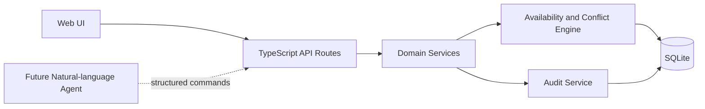
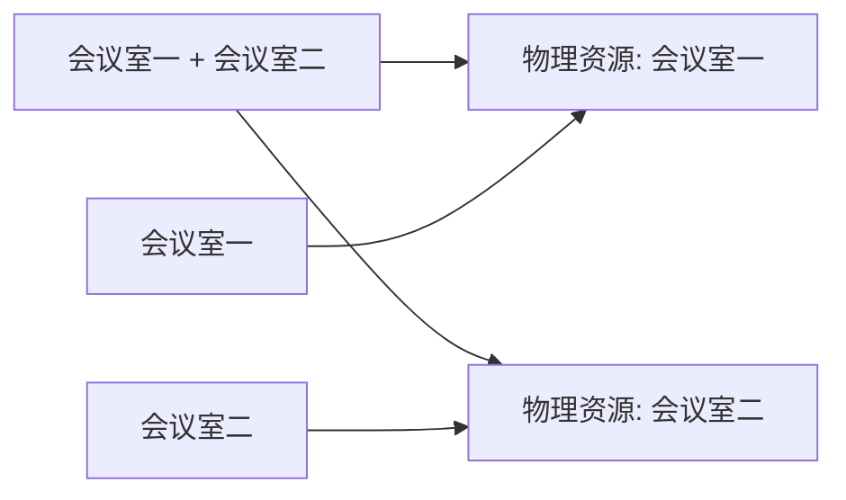

# RFC-0001: 本地会议室查询与预订系统

## 摘要

本 RFC 定义一个本地可运行的会议室查询与预订系统。首版使用单仓 TypeScript Web 应用和 SQLite 保存会议室、规则、预约与审计状态，优先打通查询、预订、取消、组合会议室、动态禁用和管理员强制调整。所有规则必须进入持久化状态并参与统一的可用性与冲突校验。自然语言 Agent、企业身份认证和地图/平面图不在首版实现范围内，但领域接口须允许后续 Agent 复用同一组业务命令，避免形成只修改对话、不修改系统状态的旁路。

## 动机

团队当前需要围绕真实办公空间管理会议预约，核心难点不是展示静态房间信息，而是确保以下状态约束在查询和写入时始终一致：

- 活动室在工作日午餐时段作为餐厅，不能预约会议；
- 会议室一和会议室二既可独立使用，也可作为大会议室合并使用；
- 502 每周二全天不可用；
- 503、504、505、506 与 502 同属小会议室，可参与按容量和可用时段查询；
- 临时维护规则可被原位修正，并立即反映到列表、日历和冲突校验；
- 管理员强制调整不能破坏最终“同一物理空间无重叠预约”的不变量。

如果每个界面或未来 Agent 各自实现规则，查询结果和最终预订容易出现分歧。因此需要先建立统一、持久化且可事务校验的领域核心，再让 Web UI 和未来 Agent 复用。

## 设计

### 概述

系统采用本地单体架构：浏览器访问 TypeScript Web 应用，服务端 API 调用领域服务，领域服务在 SQLite 事务内读写状态。系统使用 `Asia/Shanghai` 解释用户日期与日历边界，持久化时间点统一保存为 UTC，并在 API 边界返回带时区语义的时间。

首版不接入 LLM 或 Agent 服务。Web 表单和日历操作直接调用稳定的领域命令；未来自然语言 Agent 只能把解析结果映射为这些命令，不得直接写数据库。这样可以先证明预订、取消、合并、查询、规则修改和强制调整真实连通。

初始化数据包含以下可预订空间：

| 名称 | 类型 | 建议容量 | 位置 | 建议设备 | 固定约束 |
|------|------|----------|------|----------|----------|
| 活动室 | 多功能空间 | 40 | 公共活动区 | 投影、音响 | 工作日 11:30–13:30 用作餐厅 |
| 会议室一 | 标准会议室 | 12 | 会议区 | 显示屏、白板、视频会议 | 可与会议室二组合 |
| 会议室二 | 标准会议室 | 12 | 会议区 | 显示屏、白板、视频会议 | 可与会议室一组合 |
| 502 | 小会议室 | 6 | 5 楼 | 显示屏、白板 | 每周二全天不可用 |
| 503 | 小会议室 | 6 | 5 楼 | 显示屏、白板 | 无 |
| 504 | 小会议室 | 6 | 5 楼 | 显示屏、白板 | 无 |
| 505 | 小会议室 | 6 | 5 楼 | 显示屏、白板 | 无 |
| 506 | 小会议室 | 6 | 5 楼 | 显示屏、白板 | 无 |

容量、位置和设备是可修改配置；上述空间关系以及活动室午餐、502 周二禁用规则是系统初始化时必须存在的业务基线。默认开放时间为每日 08:00–22:00。

### 关键设计决策

1. **物理资源与可预订空间分离**：会议室一、会议室二分别对应物理资源，合并后的“大会议室”是同时占用两项资源的组合空间，而不是第三个独立房间。任何查询或写入都对底层资源集合判冲突，确保合并期间不能分别预订。
2. **规则和预约统一参与可用性计算**：开放时段、周期禁用和临时禁用均持久化为规则；可用性服务计算候选空间时同时检查规则占用与预约占用，不在 UI 中硬编码特殊情况。
3. **事务内二次冲突校验**：可用性查询仅作提示。创建或修改预约必须在 SQLite 写事务中重新校验全部物理资源，避免“先查可用、后写入”之间产生重复预约。
4. **规则具有稳定身份**：动态禁用创建后获得稳定 `ruleId`；修改范围使用 `PATCH` 更新同一记录。未来 Agent 对“刚才说错了”的会话内修正也必须解析到该 `ruleId`，从而满足 504 全天维修改为仅下午时不产生两条同时生效的规则。
5. **强制调整仍保持无重叠不变量**：普通修改遇到冲突即拒绝。显式 `force` 调整会在同一事务中取消所有受影响预约、记录原因和前后状态，再应用目标变更；事务结束后数据库内不得存在物理资源重叠预约。
6. **单用户模式不是授权模型**：首版不登录、不接企业身份，界面可进入成员操作和管理员操作，但服务端不把它视为安全边界。部署到多人或非本机环境前，必须由后续 RFC 引入真实认证和授权。
7. **审计与业务状态分离**：预约取消使用状态转换保留记录，管理规则与强制调整写入追加式审计事件。审计事件不参与冲突计算，但可解释“谁在何时以何原因改变了什么”。首版操作者记录为本地显示名或 `local-user`。

### 领域模型

- **Room**：用户可见的可预订空间，包含名称、位置、容量、设备、启用状态和默认开放时段。
- **Resource**：实际发生排他占用的物理空间。
- **RoomResource**：Room 到一个或多个 Resource 的映射。合并空间映射到会议室一和会议室二两个 Resource。
- **AvailabilityRule**：开放或禁用规则，包含稳定 ID、目标 Room/Resource、周期或一次性时间范围、原因和启用状态。
- **Reservation**：会议标题、说明、起止时间、所选 Room、状态和创建/更新时间。
- **ReservationResource**：预约实际占用的资源快照，用于稳定、直接地执行重叠校验。
- **AuditEvent**：对预约和规则的关键变更记录，包含操作类型、原因、目标、变更前后摘要和时间。

预约和禁用区间均采用半开区间 `[start, end)`；因此一场会议在 11:00 结束，另一场可在 11:00 开始。所有写操作要求 `start < end` 且位于目标空间开放时段内。取消状态的预约不参与冲突计算。

### 接口契约

API 以 `/api` 为前缀，成功响应返回资源或命令结果；校验失败返回结构化错误：

```text
{
  "error": {
    "code": "STABLE_MACHINE_CODE",
    "message": "面向用户的清晰说明",
    "conflicts": [{ "type", "id", "name", "start", "end", "reason" }]
  }
}
```

核心错误码至少包括 `VALIDATION_ERROR`、`OUTSIDE_OPEN_HOURS`、`RULE_BLOCKED`、`RESERVATION_CONFLICT`、`NOT_FOUND` 和 `FORCE_REASON_REQUIRED`。

#### 房间与可用性

- `GET /api/rooms`：按日期/时段可选过滤，返回名称、位置、容量、设备、组合关系及当前状态。
- `GET /api/rooms/:roomId/calendar?from=&to=`：返回指定区间内的预约和阻塞时段。
- `GET /api/availability?start=&end=&capacity=&equipment=`：返回满足条件的可用房间；组合空间只在全部底层资源可用时返回。
- `POST /api/rooms`、`PATCH /api/rooms/:roomId`：维护房间基础配置和开放时段。首版无鉴权，但仅从管理员界面暴露。

#### 禁用规则

- `GET /api/rules`：查询固定、周期和临时规则。
- `POST /api/rules`：创建动态禁用规则。
- `PATCH /api/rules/:ruleId`：原位修改规则范围、原因或启用状态，响应保留相同 `ruleId`。
- `DELETE /api/rules/:ruleId`：停用可删除的动态规则；业务基线规则不可物理删除，可通过受控配置调整但必须保留审计。

#### 预约

- `POST /api/reservations`：创建预约，输入至少包含 `roomId`、`title`、`start`、`end`；服务端返回占用的底层资源。
- `PATCH /api/reservations/:reservationId`：修改标题、说明、房间或时段；默认冲突即拒绝。
- `POST /api/reservations/:reservationId/cancel`：取消预约并立即释放资源，重复取消保持幂等。
- `POST /api/reservations/:reservationId/force-adjust`：输入目标房间/时段、必填原因及 `force: true`。响应列出被自动取消的冲突预约；整个操作原子提交。
- `GET /api/reservations?from=&to=&roomId=&status=`：为列表和日历提供预约查询。

所有写接口支持由客户端提供幂等键，避免重复提交产生重复预约或重复强制操作。接口返回的实体包含 `createdAt`、`updatedAt`，可修改实体包含用于并发更新检测的版本字段；过期版本更新必须明确失败，而不是静默覆盖。

### Web 交互范围

首版 Web UI 包含：

1. 会议室列表与容量、设备、位置、组合关系展示；
2. 按日/周查看房间预约和禁用时段的日历；
3. 使用表单查询可用房间并创建预约；
4. 查看、修改和取消已有预约；
5. 管理员界面维护房间配置和动态禁用规则；
6. 管理员显式强制调整预约，并在确认框中展示将被取消的冲突预约。

地图/平面图和自然语言输入不在本 RFC 的首版 UI 中。

### 架构图





### 关键不变量

1. 任一有效预约所占用的每个物理资源，在同一时间最多属于一条有效预约。
2. 预约不得与适用于其房间或底层资源的有效禁用规则重叠。
3. 组合空间预约必须原子占用全部底层资源，不能部分成功。
4. 取消预约后其资源立即可用，但取消记录和审计记录保留。
5. 强制调整完成后仍满足以上不变量；被影响预约必须处于取消状态并可追溯原因。
6. 规则更新必须通过稳定 ID 原位生效，列表、日历、可用性查询和后续预约共享同一状态来源。

## 权衡取舍

### 考虑过的替代方案

1. **将合并会议室建模为独立房间并复制预约**：实现直观，但多条预约的原子性和取消一致性较差，容易出现只占用一半空间，因此不采用。
2. **在界面层硬编码午餐和周二规则**：开发快，但 API、日历和未来 Agent 会得到不同结果，无法满足“配置真实进入系统状态”，因此不采用。
3. **仅依赖先查询再创建**：无法防止并发请求在同一空闲时段同时写入，因此必须在写事务中二次校验。
4. **管理员强制调整后允许重叠**：会破坏所有下游对可用性的基本假设，因此改为原子取消冲突预约后再调整。
5. **首版直接接入 LLM Agent**：会同时引入提示词、模型供应商、工具调用和歧义确认等变量，不利于先验证领域状态正确性，因此延后到独立 RFC。
6. **首版引入企业登录和多租户数据库**：超出本地演示和核心流程范围。首版清晰标记无安全边界，后续部署前补齐。

### 缺点

- 单用户无认证模式只适用于可信本地环境，不能直接暴露到共享网络。
- SQLite 适合本地与小团队规模；若后续需要多实例服务，事务和并发模型需迁移到服务型数据库。
- 不接 Agent 时无法在本阶段验证自然语言理解，只能验证未来 Agent 所依赖的业务命令与真实状态闭环。
- 建议容量、设备和位置是产品补充信息，实施或验收反馈可能要求调整默认值，但不得改变空间关系和已确认固定规则。

## 实现计划

### 阶段划分

- [ ] Phase 1：搭建可运行的 TypeScript Web/SQLite 工程与领域数据基线。
- [ ] Phase 2：实现统一规则、可用性、预约和管理员调整命令。
- [ ] Phase 3：实现会议室列表、日历、预订与管理界面。
- [ ] Phase 4：完成跨层验收、并发验证和本地运行文档。

### 子任务分解

#### 依赖关系图


#### 子任务列表

| ID | 标题 | 依赖 | Ref |
|----|------|------|-----|
| T1 | 工程与持久化基线 | - | - |
| T2 | 房间配置与规则管理 | T1 | - |
| T3 | 可用性与冲突引擎 | T1, T2 | - |
| T4 | 预约生命周期与管理员调整 | T3 | - |
| T5 | 列表、日历与管理界面 | T2, T4 | - |
| T6 | 跨层验收与运行文档 | T5 | - |

> **并行提示**：T2 开始后，可将 T3 的纯区间算法测试准备作为并行工作，但 T3 集成必须等待 T2 的规则契约稳定；其余任务按 DAG 顺序推进。

#### 子任务定义

**T1: 工程与持久化基线**
- **范围**：初始化单仓 TypeScript Web 工程、SQLite 数据访问、迁移、种子数据、统一时间与错误契约；建立 Room、Resource、组合映射、Reservation、AvailabilityRule 和 AuditEvent 的持久化边界。
- **验收标准**：一条命令可在本地启动；空数据库可迁移并幂等写入活动室、会议室一/二、组合空间及 502–506；时区固定为 `Asia/Shanghai`；迁移和种子测试通过。

**T2: 房间配置与规则管理**
- **范围**：实现房间列表/修改、开放时段、周期规则、动态禁用和审计 API；落地活动室午餐和 502 周二固定规则。
- **验收标准**：规则写入后立即影响读取；504 全天维修可通过同一 `ruleId` 修改为仅下午且数据库中只有一条对应动态规则；非法区间和过期版本更新被拒绝；关键变更可审计。

**T3: 可用性与冲突引擎**
- **范围**：实现半开区间计算、开放时段校验、规则冲突、预约冲突、容量/设备过滤以及组合资源的统一可用性查询。
- **验收标准**：单元测试覆盖边界相接、跨日、周期规则和组合资源；下周二 10:00–11:00 的小会议室结果不含 502；活动室工作日 11:30–13:30 不可用；组合空间仅在两个底层资源均可用时返回。

**T4: 预约生命周期与管理员调整**
- **范围**：实现创建、查询、修改、取消、幂等提交和强制调整；所有资源检查与写入在事务中完成。
- **验收标准**：重叠预约返回清晰冲突；取消后时段立即释放且重复取消幂等；预订组合空间后会议室一/二均不可单独预订；`force` 原子取消冲突预约并记录原因，提交后的有效预约无资源重叠；并发写入测试证明同一资源同一时段最多一条成功。

**T5: 列表、日历与管理界面**
- **范围**：实现会议室列表、日/周日历、可用性查询、创建/修改/取消预约，以及房间、规则和强制调整管理界面。
- **验收标准**：用户可从查询结果完成预订并在日历看到状态；禁用和预约使用可区分的状态展示；冲突提示包含房间、时段和原因；强制调整前明确展示将取消的预约；核心流程具备组件或浏览器自动化测试。

**T6: 跨层验收与运行文档**
- **范围**：建立确定性时钟的集成/E2E 场景，验证固定规则、规则修正、合并预约、取消释放和管理员调整；补齐本地启动、迁移、重置与测试文档。
- **验收标准**：RFC 场景在固定日期下可重复运行；领域层变更代码单元测试覆盖率达到 80% 以上，核心功能集成覆盖完整；类型检查、格式、lint、单元、集成和 E2E 命令全部通过；README 清楚说明首版无认证且不含 Agent 服务。

### 影响范围

- Web 应用与 API 路由：会议室、日历、预约和管理操作。
- 领域层：时间区间、规则、可用性、冲突、组合资源和强制调整。
- SQLite：schema、迁移、种子与事务约束。
- 测试：领域单元测试、API 集成测试、浏览器核心流程测试。
- 文档：本地运行、数据重置、限制与后续 Agent 接入边界。

## 测试方案

### 单元测试

- 时间区间采用 `[start, end)`，覆盖相邻、不相交、包含、部分重叠和非法区间。
- `Asia/Shanghai` 下工作日、每周二、跨日和日期边界计算。
- 房间到资源集合展开，尤其是会议室一/二组合空间。
- 周期规则、一次性规则、开放时段及规则原位更新。
- 强制调整的冲突集合计算和最终无重叠不变量。
- 变更领域逻辑覆盖率目标不低于 80%。

### 集成测试

使用真实临时 SQLite 数据库验证：

1. 固定“当前时间”，查询下周二 10:00–11:00、容量不超过小会议室范围的可用空间，502 不在结果中，其他未占用小会议室可返回。
2. 工作日中午预订活动室被 `RULE_BLOCKED` 拒绝，日历显示午餐禁用原因。
3. 本周五 14:00–16:00 创建组合空间预约成功后，同期预订会议室一或会议室二均返回冲突。
4. 为 504 创建周三全天维修规则，再以相同 `ruleId` 改为 12:00–22:00；上午恢复可用、下午禁用，规则列表只有一条该维修记录。
5. 创建、取消、再次预订同一时段成功；重复取消结果幂等。
6. 管理员强制调整到冲突时段，冲突预约被取消并带原因，目标预约成功，审计完整且无最终重叠。
7. 两个并发请求竞争同一资源和时段，只有一个成功。

### 手动验证

1. 初始化数据库并启动本地应用。
2. 从会议室列表核对活动室、会议室一/二、组合空间和 502–506 的基础信息。
3. 在日历与查询页依次执行集成测试中的四个业务场景。
4. 修改 504 维修规则后刷新页面，确认规则 ID 不变，上午与下午状态立即变化。
5. 取消预约并重新查询，确认时段已释放。
6. 执行一次强制调整，确认提示、取消结果和审计记录一致。

## 未解决的问题

无。自然语言 Agent、地图/平面图、企业身份认证和多用户授权均明确推迟到后续独立 RFC，不作为本 RFC 的未决实现问题。

## 参考资料

- 初始需求：Topic A 会务系统（本次对话确认）。
- 后续 RFC 候选：自然语言配置与预约 Agent、企业身份与授权、地图/平面图视图。
