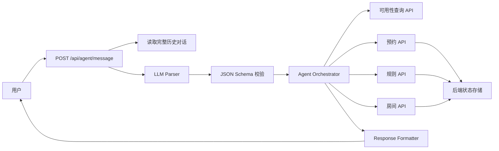
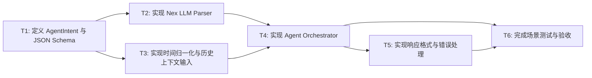

# RFC-0002: 会议室预约系统 Agent 编排设计

## 摘要

本 RFC 设计会议室预约系统中 Agent 部分的职责边界、接口契约和主要流程。Agent 负责把用户的自然语言请求解析为严格 JSON 意图，结合完整对话历史编排后端业务接口，并把后端结果转成自然语言回复。最终的状态写入、权限校验、冲突校验和规则持久化由后端负责，Agent 不直接裁决预约是否成功，也不绕过后端写入系统状态。

本方案采用 TypeScript 实现，并通过 northgate 提供的 OpenAI-compatible LLM API 完成自然语言解析；API key 只能保存在服务端环境变量中，不能进入前端、代码仓库或日志。当前 RFC 不覆盖会议室 UI、后端数据库实现、地图/平面图视图和真实认证服务接入。

## 动机

会议室预约系统需要让管理员和成员通过自然语言完成配置、查询、预约、取消和规则修正。单纯依赖传统表单会降低使用效率，但如果让 LLM 直接操作状态，又容易产生幻觉、权限越界和冲突校验不一致的问题。

因此需要明确 Agent 的边界：Agent 负责理解和编排，后端负责状态、权限、规则和冲突校验。这样既能提供自然语言体验，又能保证预约、取消、规则修改等行为真正进入系统状态，并在后续查询和预约中参与冲突校验。

## 设计

### 用户看到的完整流程

1. 管理员或成员在对话界面输入自然语言，例如“下周二 10:00—11:00 想约一间小会议室开项目讨论”。
2. Agent 运行时读取 `conversationId` 对应的完整历史对话，并把当前消息、历史消息、用户身份和系统上下文发送给 LLM。
3. LLM 只能返回严格 JSON，Agent 运行时使用 TypeScript schema 校验解析结果。
4. Agent 编排器根据 JSON 意图调用后端业务接口，例如可用性查询、预约创建、预约取消、不可预约规则创建或规则更新。
5. 后端完成权限校验、规则校验、冲突校验和状态写入，并返回结构化结果。
6. Agent 把后端结果转成自然语言回复；如果信息不足、权限不足或后端拒绝，Agent 明确说明原因或追问补充信息。

### 概述

Agent 层由四个核心组件组成：

- **LLM Parser**：调用 LLM，将自然语言解析为 `AgentIntent` 或 `NeedClarification`。
- **Schema Validator**：校验 LLM 输出是否为合法 JSON，并保证意图类型和字段符合约定。
- **Orchestrator**：根据校验后的意图调用后端业务 API，并处理后端返回的冲突、权限和错误。
- **Response Formatter**：把结构化结果转换为自然语言回复。

后端业务接口只通过契约暴露给 Agent，Agent 不直接访问数据库，也不自行执行冲突判断。完整历史对话由会话上下文服务提供，Agent 只消费 `conversationId` 和 `history`，不定义新的长期存储机制。

### 概念模型

- **用户**：成员或管理员。成员可以查询和预约会议室；管理员可以配置会议室和规则。最终权限由后端校验。
- **AgentIntent**：Agent 对自然语言的结构化理解结果，例如查询可用会议室、创建预约、取消预约、创建不可预约规则、更新上一条规则。
- **ConversationHistory**：按 `conversationId` 组织的完整历史对话，包含用户消息、Agent 回复、解析出的意图和已执行动作。
- **Business API**：后端提供的会议室、规则、预约和冲突校验接口，是状态写入和冲突判断的唯一权威来源。
- **Nex LLM Client**：调用 northgate API 的 TypeScript 客户端，只用于自然语言解析，不用于最终业务裁决。

### 关键设计决策

1. **Agent 只负责解析和编排，后端负责最终状态与冲突校验**
   - 原因：预约是否成功取决于房间状态、开放时间、固定规则、临时规则、组合空间锁定和已有预约。Agent 无法可靠掌握所有状态，必须以后端返回为准。
   - 例子：用户说“明天中午预约活动室”，Agent 可以识别出活动室和中午时间，但是否被午餐规则阻止由后端冲突校验返回。

2. **LLM 输出必须是严格 JSON**
   - 原因：自然语言直返难以测试，也容易产生不可路由的回复。严格 JSON 让意图识别、权限检查、后端调用和错误处理都有稳定入口。
   - 例子：用户输入“刚才说错了，只停用下午”应解析为 `update_last_unavailability_rule`，而不是直接生成自然语言说明。

3. **使用内置默认时间语义，并由后端最终解释业务时间**
   - 原因：基础场景需要稳定处理“下周二”“本周五”“中午”“下午”“全天”等表达。
   - 默认语义：上午 `09:00-12:00`，中午 `11:30-13:30`，下午 `13:00-18:00`，晚上 `18:00-21:00`，全天 `00:00-24:00`。日期归一化基于服务端时区，建议为 `Asia/Shanghai`。

4. **完整历史对话由会话服务提供，Agent 不自行定义隐私和保留策略**
   - 原因：用户选择 Agent 需要完整历史，以便处理“刚才说错了”“还是约刚才那间”等上下文修正。
   - 本 RFC 只规定 Agent 需要能读取 `conversationId` 对应的完整历史，并把它作为解析输入；历史存储介质、保留期限、删除策略和审计要求由后端或平台对话服务承接。

5. **权限由后端最终校验，Agent 不信任前端传来的角色**
   - 原因：管理员配置、取消他人预约和强制调整预约属于高权限操作。
   - Agent 可以把用户身份和角色作为上下文传给后端，但后端必须基于真实认证上下文重新授权。

6. **组合会议室建模为虚拟会议室，后端负责锁定组件房间**
   - 原因：会议室一和会议室二合并使用时，必须保证两个组件同时可用，并在预约成功后防止被分别预约。
   - Agent 只需要把“合并使用”映射到 `combined_room_1_2` 或等价虚拟房间 ID。

### 接口契约

#### Agent 统一入口

路径：`POST /api/agent/message`

触发时机：用户在对话界面发送任意自然语言消息。

请求：

| 字段 | 类型 | 必填 | 说明 |
|------|------|------|------|
| `userId` | string | 是 | 当前用户 ID，由认证上下文提供 |
| `conversationId` | string | 是 | 当前对话 ID，用于读取完整历史 |
| `message` | string | 是 | 用户当前输入 |
| `authContext` | object | 是 | 后端认证上下文或权限上下文，由服务端注入 |

响应：

| 字段 | 类型 | 说明 |
|------|------|------|
| `reply` | string | 给用户展示的自然语言回复 |
| `parsedIntent` | object/null | 本次解析出的意图；信息不足时为空 |
| `actions` | array | Agent 已执行或尝试执行的后端动作 |
| `error` | object/null | 解析、权限或后端调用失败信息 |

示例：

```json
{
  "userId": "u_001",
  "conversationId": "c_001",
  "message": "下周二 10:00—11:00 想约一间小会议室开项目讨论，帮我看看有哪些可以用。",
  "authContext": {}
}
```

#### LLM Parser 输出契约

LLM 输出必须是 JSON，并经过 TypeScript schema 校验。核心意图包括：

| 意图 | 说明 | 典型输入 |
|------|------|------|
| `query_available_rooms` | 查询指定时间可用的会议室 | “下周二 10:00—11:00 有哪些小会议室可用” |
| `create_booking` | 创建预约，最终是否成功由后端决定 | “明天 10:00 到 11:00 帮我约 506” |
| `cancel_booking` | 取消已有预约 | “取消我明天上午 506 的会议” |
| `create_unavailability_rule` | 创建不可预约规则 | “这周三 506 临时维修，全天不能预约” |
| `update_last_unavailability_rule` | 修改上一条不可预约规则 | “刚才说错了，只停用下午” |
| `create_or_update_room` | 新增或修改会议室基础信息 | “把 506 容量改成 6 人” |
| `create_combined_room` | 创建组合会议室 | “会议室一和会议室二可以合并成大会议室” |
| `need_clarification` | 信息不足，需要追问 | “帮我约个会议室” |

`need_clarification` 必须包含缺失字段和追问文本。例如：

```json
{
  "type": "need_clarification",
  "missingFields": ["date", "startTime", "endTime"],
  "clarification": "请告诉我你想预约哪一天，以及具体开始和结束时间。"
}
```

#### 后端业务接口契约

Agent 编排器只调用后端业务接口，不直接写数据库。

| 接口 | 用途 |
|------|------|
| `POST /api/availability/check` | 查询指定日期和时间范围内可用的会议室 |
| `POST /api/bookings` | 创建预约 |
| `DELETE /api/bookings/:id` | 取消预约 |
| `POST /api/bookings/conflict-check` | 对指定房间和时间段执行冲突校验 |
| `GET /api/rooms` | 获取会议室列表 |
| `POST /api/unavailability-rules` | 创建不可预约规则 |
| `PATCH /api/unavailability-rules/:id` | 更新不可预约规则 |
| `POST /api/room-groups` | 创建组合会议室 |
| `GET /api/conversations/:conversationId/history` | 读取完整历史对话 |

可用性查询请求：

| 字段 | 类型 | 必填 | 说明 |
|------|------|------|------|
| `date` | string | 是 | `YYYY-MM-DD` |
| `startTime` | string | 是 | `HH:mm` |
| `endTime` | string | 是 | `HH:mm` |
| `filters` | object | 否 | 房间类型、容量、设备等过滤条件 |

预约创建请求：

| 字段 | 类型 | 必填 | 说明 |
|------|------|------|------|
| `userId` | string | 是 | 预约人 |
| `roomId` | string | 是 | 房间 ID 或组合房间 ID |
| `date` | string | 是 | `YYYY-MM-DD` |
| `startTime` | string | 是 | `HH:mm` |
| `endTime` | string | 是 | `HH:mm` |
| `title` | string | 否 | 会议标题 |
| `description` | string | 否 | 会议描述 |
| `attendees` | number | 否 | 参会人数 |

不可预约规则请求：

| 字段 | 类型 | 必填 | 说明 |
|------|------|------|------|
| `target` | string | 是 | 房间 ID、组合房间 ID 或规则目标 |
| `date` | string | 否 | 一次性规则日期 |
| `timeRange` | object | 否 | 时间范围 |
| `recurring` | object | 否 | 每周重复规则 |
| `reason` | string | 是 | 不可预约原因 |

#### 错误契约

| 错误类型 | 触发条件 | Agent 回复策略 |
|----------|----------|----------------|
| `need_clarification` | 缺少日期、时间、房间或目标 | 追问缺失信息 |
| `permission_denied` | 后端拒绝当前用户执行操作 | 明确说明无权限，不暴露内部细节 |
| `conflict` | 预约与已有预约、开放时间或不可预约规则冲突 | 展示冲突原因和建议替代时间 |
| `not_found` | 房间、预约或规则不存在 | 说明找不到目标，并引导重新选择 |
| `backend_unavailable` | 后端接口不可用 | 说明暂时无法完成，请稍后重试 |
| `parse_failed` | LLM 输出不是合法 JSON 或 schema 校验失败 | 记录错误，要求用户重试或转人工兜底 |

### 架构图



## 权衡取舍

### 考虑过的替代方案

1. **让 Agent 直接操作数据库并自行判断冲突**
   - 未采用原因：LLM 输出不稳定，无法保证权限、冲突和审计正确性。预约系统需要确定性状态，不能把最终裁决交给自然语言模型。

2. **让 Agent 直接返回自然语言动作，由后端再解析**
   - 未采用原因：自然语言动作难以测试，也难以处理多轮修正和错误恢复。严格 JSON 更容易做 schema 校验、单元测试和端到端追踪。

3. **只做 LLM 接入，不做业务编排**
   - 未采用原因：本系统的核心体验不是“解释一句话”，而是让配置、预约、取消和规则修改真正进入系统状态。只接入 LLM 无法覆盖完整业务流程。

4. **不做完整历史，只保存上一条规则**
   - 未采用原因：用户明确需要完整历史。只保存上一条规则可以覆盖“刚才说错了”，但无法支持“还是约刚才那间”“取消我昨天说的那场会”等更复杂上下文。

### 缺点

- 完整历史会增加上下文长度和存储压力，需要后端会话服务提供分页、索引或摘要能力。
- 严格 JSON 依赖 LLM 稳定性；如果模型输出不合法，需要重试或兜底策略。
- 内置默认时间语义可能与真实团队习惯不完全一致，后续可能需要配置化。
- Agent 与后端通过 API 契约协作，前后端需要保持接口版本一致。
- 权限最终由后端校验，Agent 层无法提前保证所有操作都会被执行。

## 实现计划

### 阶段划分

- [ ] Phase 1: 定义 Agent 类型、JSON schema、时间语义和对话历史输入契约。
- [ ] Phase 2: 实现 Nex LLM client、prompt 管理和严格 JSON 解析。
- [ ] Phase 3: 实现 Agent 编排器，接入可用性查询、预约、取消、规则创建和规则更新接口。
- [ ] Phase 4: 实现自然语言响应、错误处理和基础场景测试。

### 子任务分解

#### 依赖关系图



#### 子任务列表

| ID | 标题 | 依赖 | Ref |
|----|------|------|-----|
| T1 | 定义 AgentIntent 与 JSON Schema | - | - |
| T2 | 实现 Nex LLM Parser | T1 | - |
| T3 | 实现时间归一化与历史上下文输入 | T1 | - |
| T4 | 实现 Agent Orchestrator | T2, T3 | - |
| T5 | 实现响应格式与错误处理 | T4 | - |
| T6 | 完成场景测试与验收 | T4, T5 | - |

> **并行提示**: T2 和 T3 在 T1 完成后可以并行实现；T6 需要等待编排器和响应处理完成后统一验收。

#### 子任务定义

**T1: 定义 AgentIntent 与 JSON Schema**
- **范围**: 定义所有 Agent 意图、字段、枚举值、错误类型和 schema 校验规则。
- **验收标准**: 所有基础场景都能映射到明确意图；非法 JSON 或缺失字段能被 schema 识别。

**T2: 实现 Nex LLM Parser**
- **范围**: 实现 northgate OpenAI-compatible client、系统提示词、JSON 输出要求和解析重试机制。
- **验收标准**: Parser 能稳定输出符合 schema 的 JSON；API key 只从服务端环境变量读取，不写入代码或日志。

**T3: 实现时间归一化与历史上下文输入**
- **范围**: 实现相对日期、相对时间、默认时间语义和完整历史对话输入契约。
- **验收标准**: “下周二”“本周五”“明天中午”“下午”“全天”等表达能归一化为标准日期和时间范围。

**T4: 实现 Agent Orchestrator**
- **范围**: 根据 `AgentIntent` 调用后端业务 API，包括可用性查询、预约创建、预约取消、规则创建、规则更新和房间配置。
- **验收标准**: 编排器不直接写数据库；所有状态变更都通过后端 API；后端返回冲突或权限错误时能正确传递。

**T5: 实现响应格式与错误处理**
- **范围**: 将后端结构化结果转换为自然语言回复，并处理追问、冲突、权限不足、解析失败和后端不可用。
- **验收标准**: 用户能看到清晰的可用房间列表、预约结果、取消结果、规则更新结果和冲突原因。

**T6: 完成场景测试与验收**
- **范围**: 为解析、时间归一化、编排器和端到端场景编写测试。
- **验收标准**: 覆盖题目给出的基础场景，并验证 505 周二不可用、活动室午餐不可预约、组合会议室锁定组件、506 规则连续修改只更新同一条规则。

### 影响范围

- `src/agent/` - 新增 Agent parser、orchestrator、formatter 和 prompt 管理模块。
- `src/types/` - 新增 AgentIntent、AgentError、AgentAction 等类型定义。
- `src/services/` - 新增 Nex API client、schema validator、conversation history 输入适配。
- `src/routes/` 或 `src/api/` - 新增 `POST /api/agent/message` 路由。
- `tests/agent/` - 新增 Agent 单元测试、集成测试和场景验收测试。
- `.env.example` - 新增 `NEX_API_BASE_URL`、`NEX_API_KEY`、`NEX_MODEL` 等环境变量示例。
- `docs/api/` 或等价 API 文档位置 - 新增 Agent 与后端业务 API 的契约说明。

## 测试方案

### 单元测试

- `AgentIntent` schema 校验：合法意图通过，非法 JSON、缺失字段、未知意图失败。
- 时间归一化：今天、明天、后天、本周、下周、上午、中午、下午、晚上、全天。
- Parser prompt 输出：使用 mock LLM 返回固定 JSON，验证 Parser 能解析并校验。
- Formatter：验证可用房间、冲突、取消成功、规则更新成功等回复格式。

### 集成测试

- `POST /api/agent/message` 能读取完整历史并调用 mock 后端接口。
- `query_available_rooms` 能调用 `POST /api/availability/check` 并返回可用房间。
- `create_booking` 能调用 `POST /api/bookings`，并在后端返回冲突时展示冲突原因。
- `cancel_booking` 能调用取消接口，并在候选预约多条时触发追问或确认流程。
- `create_unavailability_rule` 和 `update_last_unavailability_rule` 能正确调用创建和更新规则接口。

### 手动验证

1. 输入“下周二 10:00—11:00 想约一间小会议室开项目讨论，帮我看看有哪些可以用。”，确认 505 不出现在周二可用结果中。
2. 输入“明天中午想预约活动室开会。”，确认系统提示活动室午餐时段不可预约。
3. 输入“本周五 14:00—16:00 要开一场大会议，帮我把会议室一和会议室二合并使用。”，确认组合房间预约会锁定会议室一和会议室二。
4. 输入“这周三 506 临时维修，全天不能预约。”，再输入“刚才说错了，只停用下午。”，确认只更新同一条 506 维修规则，并反映在日历和可用性状态中。

## 未解决的问题

无。完整历史对话的存储介质、保留期限和隐私删除策略由后端或平台对话服务承接，不在本 RFC 中重复定义。

## 参考资料

- northgate API endpoint：`https://northgate.xiaobei.top/v1`
- 模型：`nex-agi/Nex-N2-Pro`
- 会议室预约系统 Topic A 需求说明
- RFC-Driven Development 工作流
