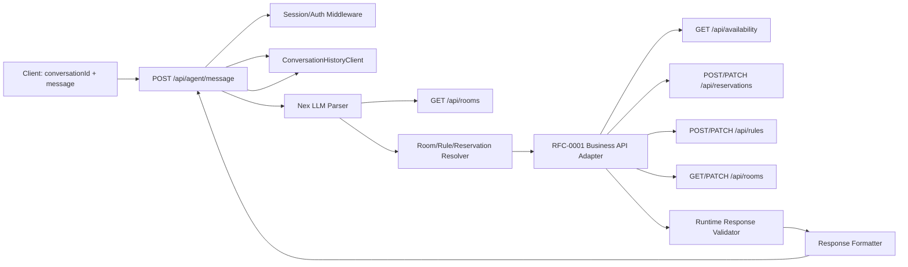
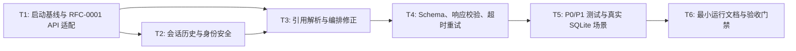

# RFC-0003: Agent 真实可用修复计划

## 摘要

本 RFC 为 RFC-0002 的 Agent 实现补充一组 P0/P1 修复计划，目标是在“真实可用”前消除启动、后端契约、会话历史、身份安全、时间解析、房间解析、规则更新、取消预约、响应校验和超时重试等阻塞问题。修复后，Agent 仍只负责自然语言解析、意图编排和自然语言回复；RFC-0001 的后端 API、SQLite 状态、规则、冲突校验和权限判断仍是唯一真相来源。

本 RFC 明确不覆盖 P2 交付质量问题：完整演示 UI、README 大改、RFC-0002 状态回退、P2 级场景测试重写和真实 Nex 常规 CI。P2 可在后续 RFC 或单独任务中处理。

## 动机

当前 Agent 部分已经形成 parser、orchestrator、formatter 和 `/api/agent/message` 路由，但仍不能算真实可用：

1. 全新 checkout 可能因为默认 SQLite 父目录不存在而无法启动。
2. `npm start` 不加载 `.env`，导致真实 Nex API key 不会被普通启动进程读取。
3. Agent 当前依赖一套与 RFC-0001 不一致的 `/api/bookings`、`/api/unavailability-rules` 等接口，而后端权威路由是 `/api/reservations`、`/api/rules`、`GET /api/availability`。
4. 路由直接信任客户端提交的 `userId`、`authContext` 和完整 `history`，存在权限伪造和上下文注入风险。
5. LLM 未收到服务器当前日期、星期和 `Asia/Shanghai` 时区，真实相对日期解析会错误。
6. 房间名到真实 ID、上一条规则到稳定 `ruleId`、取消预约到稳定 `reservationId` 都缺少确定性解析层。
7. Schema、响应格式、错误 HTTP 状态、超时重试和幂等键尚未达到真实使用要求。

因此需要一个修复 RFC，把 Agent 从“可演示的 shell”推进到“可本地真实运行的 Agent”，同时保持 Agent 与后端职责边界清晰。

## 设计

### 概述

修复后的 Agent 请求流如下：

1. 客户端只提交 `conversationId` 和 `message`，不再提交 `userId`、`authContext` 或完整历史。
2. 服务端从 session/auth middleware 或本地 demo 用户上下文解析当前用户身份。
3. Agent 路由根据 `conversationId` 从服务端历史客户端读取历史，并在本轮结束后写入本轮 user message、assistant reply、parsedIntent、actions 和业务结果。
4. Parser 在服务端启动时初始化，prompt 包含服务器当前日期、星期、`Asia/Shanghai` 时区、房间目录摘要和历史对话。
5. LLM 输出严格 JSON；Agent 先做 schema 校验，再做房间、规则、预约 ID 等引用解析。
6. Orchestrator 只调用 RFC-0001 权威后端接口：`GET /api/availability`、`POST /api/reservations`、`POST /api/reservations/:id/cancel`、`POST /api/rules`、`PATCH /api/rules/:ruleId`、`GET/PATCH /api/rooms`。
7. 所有 mutation 都携带稳定幂等键；失败按业务语义映射到 HTTP 状态码，成功或 clarification 返回 200。
8. Formatter 只基于后端返回的稳定资源结构生成自然语言回复；格式错误不再被当成成功。

### 非目标

- 不实现 P2 的完整聊天演示 UI。
- 不重写 README 为完整 Agent 运行手册；只允许补充最小启动 smoke 说明。
- 不把 RFC-0002 的 meta 状态回退为 `implementing`；本 RFC 通过自身任务和验收标准记录真实可用修复。
- 不把真实 Nex 调用纳入常规 CI；真实 Nex smoke test 仅 opt-in。
- 不引入企业级认证系统；本地演示使用服务端受控 `DEMO_USER_ID` 或 session middleware。

### 概念模型

- **AgentMessageRoute**：`POST /api/agent/message` 的服务端入口，负责请求校验、会话历史读取、parser 调用、orchestration 和历史写入。
- **ConversationHistoryClient**：按 `conversationId` 读取和追加服务端历史，不信任客户端提交的 `history`。
- **RoomReferenceResolver**：从 `GET /api/rooms` 获取房间目录，按 ID、名称、别名和组合关系解析 `roomId`、`target`、`componentRoomIds`。
- **RuleReferenceResolver**：从服务端历史中的上一轮成功 `rule.id` 或 `updatedRuleId` 解析“上一条规则”，不再调用 `/last`。
- **ReservationReferenceResolver**：取消预约时先按条件查询候选预约，0 条返回 not_found，多条要求确认，1 条才调用取消接口。
- **RFC-0001 Business API Adapter**：把 Agent 的 `date + timeRange` 转换为 RFC-0001 的 UTC `start/end`，并适配权威路由。
- **Runtime Response Validator**：校验后端 2xx 响应是否为预期资源结构，避免空 body 或 HTML 被误判为成功。

### 关键设计决策

1. **RFC-0001 是后端真相，Agent 必须适配 RFC-0001**
   - 原因：当前 Agent 自定义的 `/api/bookings`、`/api/unavailability-rules` 与 RFC-0001 权威接口分裂，容易绕过后端真实状态和测试。
   - 结果：删除或废弃 Agent 私有业务路由，Agent adapter 只调用 RFC-0001 接口。

2. **请求体只保留 `conversationId` 和 `message`**
   - 原因：`userId`、`authContext`、`history` 都可被客户端伪造或篡改。
   - 结果：服务端从 session/auth middleware 获取用户，从服务端 history client 获取历史。本地 demo 模式使用服务端配置的 `DEMO_USER_ID`。

3. **相对日期由服务端上下文确定性归一化**
   - 原因：模型不知道服务器当前日期和时区时，会把“明天”解析到错误日期。
   - 结果：prompt 注入当前日期、星期、时区；更推荐 LLM 返回 `dateExpression`，由 `time.ts` 的确定性算法归一化。

4. **房间、规则、预约 ID 必须先解析再调用 mutation**
   - 原因：真实 ID 与用户说法不同，例如用户说 `506`，数据库 ID 是 `room-506`；“上一条规则”在多用户并发下不能用 `/last` 猜。
   - 结果：房间解析器读取房间目录；规则解析器从历史 action result 取 `ruleId`；取消预约先查候选再取消。

5. **mutation 必须幂等**
   - 原因：前端重试、代理重放或用户重复点击可能创建重复预约或重复规则。
   - 结果：Agent 请求使用 `requestId` 或 `messageId`，由 `conversationId + messageId + actionType + normalizedPayloadHash` 生成稳定 idempotency key，通过 RFC-0001 的 `x-idempotency-key` 传入。

6. **真实 Nex 只作为 opt-in smoke test**
   - 原因：常规 CI 不应依赖外部网络和真实密钥。
   - 结果：常规测试使用 mock/fixed parser fixture；真实 Nex smoke test 需要显式设置环境变量后运行。

### 接口契约

#### Agent 入口

路径：`POST /api/agent/message`

请求：

| 字段             | 类型   | 必填 | 说明                                |
| ---------------- | ------ | ---- | ----------------------------------- |
| `conversationId` | string | 是   | 当前对话 ID，由服务端读取历史       |
| `message`        | string | 是   | 用户当前输入                        |
| `requestId`      | string | 否   | 前端幂等和调试 ID；缺失时服务端生成 |

服务端注入：

| 字段          | 来源                                      | 说明                         |
| ------------- | ----------------------------------------- | ---------------------------- |
| `userId`      | session/auth middleware 或 `DEMO_USER_ID` | 不信任请求体                 |
| `authContext` | session/auth middleware                   | 不返回给前端 actions payload |
| `history`     | ConversationHistoryClient                 | 不信任请求体                 |

响应：

| 字段           | 类型        | 说明                                         |
| -------------- | ----------- | -------------------------------------------- |
| `reply`        | string      | 用户可见自然语言回复                         |
| `parsedIntent` | object/null | 解析后的意图；信息不足时为空                 |
| `actions`      | array       | 已执行或尝试执行的后端动作                   |
| `error`        | object/null | 解析、权限、冲突、not_found 或后端不可用错误 |

HTTP 状态：

| 场景                                           | 状态码  |
| ---------------------------------------------- | ------- |
| malformed JSON、请求体字段错误                 | 400     |
| 无权限                                         | 403     |
| 房间、预约、规则不存在                         | 404     |
| 预约或规则冲突                                 | 409     |
| Nex 或后端不可用                               | 502/503 |
| 成功、clarification、parse_failed 的业务化回复 | 200     |

#### RFC-0001 权威后端接口适配

| Agent 操作       | RFC-0001 后端接口                                                 | 适配说明                                                      |
| ---------------- | ----------------------------------------------------------------- | ------------------------------------------------------------- |
| 查询可用房间     | `GET /api/availability?start=&end=&capacity=&equipment=`          | Agent 的 `date + timeRange` 转换为 `start/end` UTC            |
| 创建预约         | `POST /api/reservations`                                          | 使用服务端 `userId` 作为 actor，传 `x-idempotency-key`        |
| 取消预约         | `POST /api/reservations/:reservationId/cancel`                    | 先查询候选，1 条时取消                                        |
| 创建不可预约规则 | `POST /api/rules`                                                 | 规则 scope 转换为 RFC-0001 的 `targetId/start/end/recurrence` |
| 更新不可预约规则 | `PATCH /api/rules/:ruleId`                                        | 从历史 action result 获取稳定 `ruleId`                        |
| 查询房间目录     | `GET /api/rooms`                                                  | Parser 前或 resolver 阶段读取                                 |
| 修改房间         | `PATCH /api/rooms/:roomId`                                        | 至少一个可修改字段                                            |
| 创建组合房间     | RFC-0001 中无权威组合创建接口时，先作为 P2 或按 RFC-0001 扩展实现 | P0/P1 中只保证不再依赖 Agent 私有 `/api/room-groups`          |

#### 会话历史

每轮 Agent 处理完成后写入：

| 字段           | 说明                                                   |
| -------------- | ------------------------------------------------------ |
| `role`         | `user` 或 `assistant`                                  |
| `content`      | 用户消息或 Agent reply                                 |
| `parsedIntent` | 解析出的 AgentIntent 或 null                           |
| `actions`      | 后端动作列表，不含 token 或内部 authContext            |
| `result`       | 业务结果摘要，例如 `ruleId`、`reservationId`、冲突摘要 |
| `createdAt`    | 服务端时间                                             |

本地 Hackathon 最小实现可使用 SQLite 两张表：`conversations` 和 `conversation_messages`。

### 架构图

## 权衡取舍

### 考虑过的替代方案

1. **保留 Agent 自定义业务 API，并转发到 RFC-0001**
   - 优点：Agent 代码改动较小。
   - 缺点：继续维护两套接口，容易再次分裂；RFC-0001 的测试和验收无法直接证明 Agent 使用真实后端。
   - 结论：不采用。P0/P1 中 Agent 直接适配 RFC-0001 权威接口。

2. **Agent 直接调用 domain service，不走 HTTP API**
   - 优点：本地单体中更快，少一次 HTTP 适配。
   - 缺点：破坏“Agent 只通过后端 API 编排”的边界，未来拆分服务时迁移成本高。
   - 结论：不采用。Agent 通过 adapter 调用 RFC-0001 API。

3. **把真实 Nex 调用纳入常规 CI**
   - 优点：最能验证真实模型行为。
   - 缺点：依赖外部网络、真实密钥和配额，容易让 CI 不稳定。
   - 结论：不采用。常规 CI 使用 mock/fixed fixture，真实 Nex 仅 opt-in smoke test。

4. **继续信任客户端提交 `userId` 和 `history`**
   - 优点：实现最少。
   - 缺点：可伪造身份和上下文，无法安全支持真实使用。
   - 结论：不采用。服务端读取身份和历史。

### 缺点

- 服务端会话历史和幂等键会引入额外数据表或存储逻辑，增加实现复杂度。
- Agent 适配 RFC-0001 需要重写当前 adapter，短期改动较大。
- 严格 HTTP 状态映射可能影响现有前端客户端，需要确保兼容 200 成功回复。
- 不处理完整演示 UI，因此“真实可用”主要指 API 和本地 smoke 可运行，不代表产品级体验完成。

## 实现计划

### 阶段划分

- [x] Phase 1：修复启动基线、`.env` 加载和 RFC-0001 权威 API adapter。
- [x] Phase 2：实现服务端会话历史、Demo 用户身份和安全请求边界。
- [x] Phase 3：补强 parser 时间上下文、房间/规则/预约解析、schema 严格校验和响应校验。
- [x] Phase 4：补齐 P0/P1 自动化测试、真实 SQLite 场景和 opt-in Nex smoke。

### 子任务分解

#### 依赖关系图

#### 子任务列表

| ID  | 标题                                                 | 依赖           | Ref |
| --- | ---------------------------------------------------- | -------------- | --- |
| T1  | 修复启动基线与 RFC-0001 API 适配                     | -              | `d80ec5f` |
| T2  | 实现服务端会话历史、Demo 身份和 Agent 路由安全边界   | T1             | `d80ec5f` |
| T3  | 重写 Agent 房间解析、规则修改和取消预约编排          | T1, T2         | `d80ec5f` |
| T4  | 强化 LLM 时间上下文、Schema 严格校验和响应运行时校验 | T3             | `d80ec5f` |
| T5  | 补齐 P0/P1 测试、真实 SQLite 场景和 opt-in Nex smoke | T1, T2, T3, T4 | `d80ec5f` |
| T6  | 更新最小运行说明和验收门禁                           | T5             | `d80ec5f` |

> **并行提示**：T1 完成后，T2 与 T4 的 schema/响应校验设计可并行准备；T3 依赖 T2 的历史解析能力。T5 需要等待核心行为稳定后统一收口。

#### 子任务定义

**T1: 修复启动基线与 RFC-0001 API 适配**

- **范围**：默认 SQLite 父目录自动创建；`npm start/dev` 通过 `node --env-file=.env --import tsx src/server.ts` 加载环境变量；启动时只校验必要变量是否存在且不打印密钥；重写 Agent Business API adapter，删除对 `/api/bookings`、`/api/unavailability-rules/last` 等私有接口的依赖，改为 RFC-0001 权威接口。
- **验收标准**：全新 checkout 删除 `data/` 后可启动；`.env` 被加载但不打印 API key；Agent 查询、预约、取消、规则创建和规则更新均映射到 RFC-0001 接口；Adapter 层单元测试覆盖接口映射。

**T2: 实现服务端会话历史、Demo 身份和 Agent 路由安全边界**

- **范围**：新增或复用 `ConversationHistoryClient`；`createAgentMessageRoute` 注入 history client；请求体只接受 `conversationId`、`message`、可选 `requestId`；服务端注入 `userId` 和本地 demo 用户；每轮写入 user message、reply、parsedIntent、actions 和业务结果摘要；actions payload 不包含 token 或内部 authContext。
- **验收标准**：同一 `conversationId` 连续发送“这周三 506 临时维修，全天不能预约”和“刚才说错了，只停用下午”，第二轮能从历史拿到上一条 `ruleId`；客户端提交伪造 `userId` 或 `history` 被忽略；测试覆盖 malformed JSON 返回 400。

**T3: 重写 Agent 房间解析、规则修改和取消预约编排**

- **范围**：Parser 前或 resolver 阶段读取 `GET /api/rooms`；实现 `resolveRoomReference()` 支持 ID、名称、别名和组合组件；`create_combined_room` 至少两个不同组件且不能包含自己；取消预约先 `GET /api/reservations?...` 查候选，0 条 not_found，多条 clarification，1 条调用 `POST /api/reservations/:id/cancel`；`update_last_unavailability_rule` 从历史 result 获取 `ruleId` 后调用 `PATCH /api/rules/:ruleId`。
- **验收标准**：“预约 506”解析到 `room-506`；“会议室一和会议室二合并”解析到组合空间或明确走后端组合资源语义；无 bookingId 的取消不会误调用创建预约接口；规则修正只更新同一条历史记录。

**T4: 强化 LLM 时间上下文、Schema 严格校验和响应运行时校验**

- **范围**：prompt 注入当前日期、星期、`Asia/Shanghai` 时区；优先让 LLM 返回 `dateExpression` 并由 `time.ts` 确定性归一化；修正上周、本周已过去日期、跨月、跨年和本地/UTC 时区算法；schema 拒绝危险不完整意图和未知字段；Nex 与业务 fetch 设置超时、重试和指数退避；2xx 响应做运行时 schema 校验，空 body 或 HTML 映射为 backend_unavailable；mutation 成功必须返回稳定资源 ID。
- **验收标准**：当前日期 2026-07-31 时“明天上午”归一化为 2026-08-01 09:00-12:00；上周二、跨月、跨年测试通过；取消只有 date、规则只有 target+reason、组合只有一个组件、更新房间无修改字段均被拒绝；后端格式错误不会生成假成功文案。

**T5: 补齐 P0/P1 测试、真实 SQLite 场景和 opt-in Nex smoke**

- **范围**：使用真实临时 SQLite、真实 domain service 和 Hono 路由验证 P0/P1 场景；保留 mock/fixed parser fixture 作为常规测试；新增 opt-in 真实 Nex smoke test，只有设置显式环境变量时才运行；覆盖启动、会话历史、房间解析、规则稳定 ID、取消候选、HTTP 状态映射、超时重试和响应校验。
- **验收标准**：`npm run typecheck`、`npm test`、`npm run test:agent`、真实 SQLite 场景测试通过；真实 Nex smoke test 在未设置 opt-in 变量时跳过；常规 CI 不消耗真实密钥。

**T6: 更新最小运行说明和验收门禁**

- **范围**：补充最小启动说明、`.env.example` 占位符、curl 示例和 smoke test 命令；明确 `.env` 不提交、权限应 600、真实密钥不得进入仓库；记录本 RFC 的完成门禁。
- **验收标准**：新开发者可按 README 最小步骤启动；`npm start` 能读取 `.env` 且不打印密钥；`.env.example` 不含真实 key；`.env` 权限为 600；本 RFC 不调整 RFC-0002 的 meta 状态，但验收门禁清晰记录 P0/P1 已修复。

### 影响范围

- `src/db/index.ts`、`src/db/ensure.ts`：默认数据库目录创建和启动校验。
- `package.json`：`start/dev` 加载 `.env`，测试脚本区分常规 Agent/API 测试和真实 Nex smoke。
- `src/api/agent.ts`：请求校验、服务端身份、历史读取、parser 初始化、错误状态映射。
- `src/api/history.ts`：会话历史读写。
- `src/agent/nex.ts`：prompt 当前日期/时区、超时重试、schema 错误修正上下文。
- `src/agent/schema.ts`、`src/agent/time.ts`：严格 schema、相对日期和时区算法。
- `src/agent/businessApi.ts`：RFC-0001 adapter、房间/规则/预约解析、响应运行时校验。
- `src/agent/orchestrator.ts` 或等价模块：取消候选、规则 ID、幂等键和后端错误映射。
- `src/agent/formatter.ts`：解包 `RoomResult`、拒绝空 Booking/Rule 成功文案。
- `tests/agent/**`、`tests/api/**`、`tests/db/**`：P0/P1 自动化测试和 opt-in Nex smoke。
- `docs/rfcs/0003-agent-real-usage-fixes.md`、`docs/rfcs/meta/0003-agent-real-usage-fixes.json`、`docs/rfcs/README.md`。
- `.env.example`、`.env` 权限和 `.gitignore` 验证。

## 测试方案

### 单元测试

- 默认数据库路径父目录自动创建。
- 时间归一化：上周、本周已过去日期、下周、跨月、跨年、`Asia/Shanghai` 与本地时区差异。
- AgentIntent schema：拒绝危险不完整意图、未知字段、组合房间单组件、更新房间无修改字段。
- RoomReferenceResolver：ID、名称、别名、组合组件和歧义处理。
- RuleReferenceResolver：从历史 action result 获取 `ruleId`，找不到时 clarification。
- ReservationReferenceResolver：0 条、1 条、多条候选。
- Runtime response validator：Room、Booking/Reservation、Rule、Availability 响应结构校验。
- Formatter：解包 `RoomResult`，空 Booking/Rule 不生成假成功。

### 集成测试

使用真实临时 SQLite 和 Hono 路由验证：

1. 删除临时 `data/` 父目录后，服务可启动并创建默认数据库。
2. `npm start` 或等价入口读取 `.env`，不打印 `NEX_API_KEY`。
3. 同一 `conversationId` 连续两轮规则修正只更新同一条规则。
4. “预约 506”映射到 `room-506`，并调用 RFC-0001 创建预约接口。
5. 无 bookingId 的取消先查询候选，再调用 `POST /api/reservations/:id/cancel`。
6. 后端返回 400/403/404/409/5xx 时，Agent API 映射到对应 HTTP 状态。
7. 后端返回空 body 或 HTML 时，Agent 返回 backend_unavailable，不宣称成功。

### opt-in 真实 Nex smoke

- 只有设置如 `RUN_REAL_NEX_SMOKE=true` 且提供 `NEX_API_KEY` 时运行。
- 使用固定提示：“当前日期 2026-07-31，明天上午预约 506”，验证 parser 返回正确日期、时间和房间引用。
- 不写入真实预约，只验证 parser 层。

### 手动验证

1. 删除本地 `data/`，运行 `npm start`，确认服务启动。
2. 确认 `.env` 权限为 600，`git status --short` 不显示 `.env`。
3. 用 curl 发送同一 `conversationId` 两轮规则修正，确认只更新同一条规则。
4. 用 curl 发送“预约 506”，确认映射到 RFC-0001 预约接口并返回稳定 reservationId。
5. 用 curl 发送无 bookingId 的取消，确认先查候选，再取消唯一候选。

## 未解决的问题

无。P2 范围问题已明确不在本 RFC 内处理。

## 参考资料

- RFC-0001：本地会议室查询与预订系统。
- RFC-0002：会议室预约系统 Agent 编排设计。
- 用户 review 出的 P0/P1 问题清单。
- northgate API endpoint：`https://northgate.xiaobei.top/v1`。
- 模型：`nex-agi/Nex-N2-Pro`。
