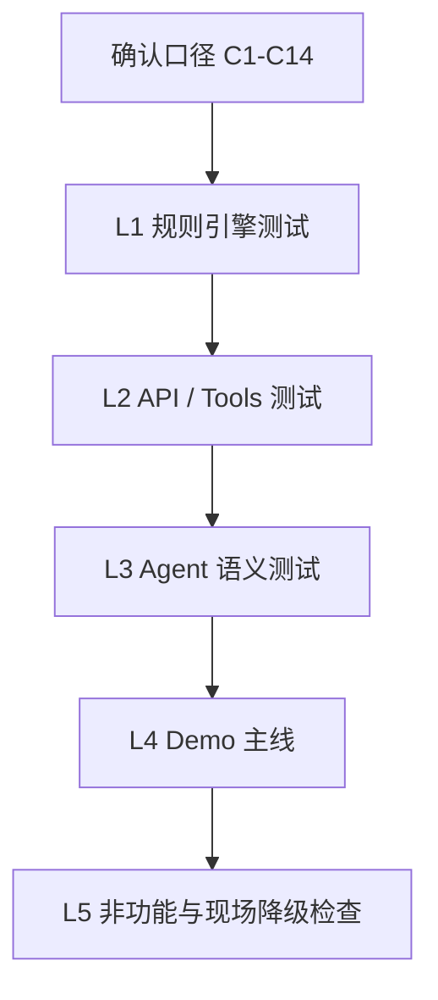
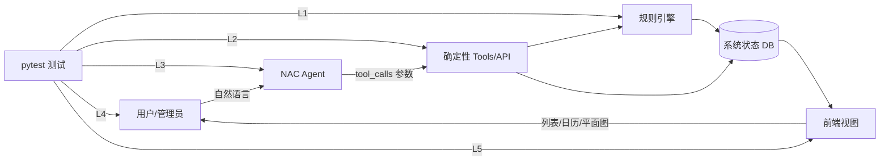
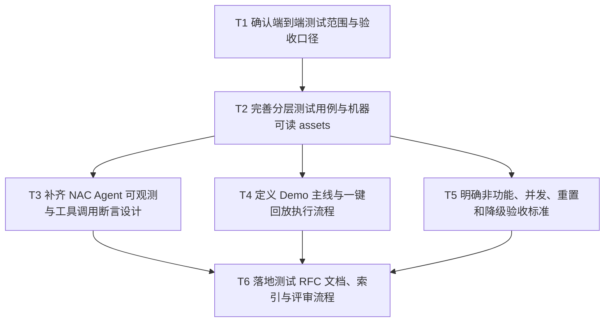

# RFC-0003: 会务系统端到端测试 RFC

## 摘要

本 RFC 定义会务系统（Hackathon Topic A）的端到端测试策略、分层验收标准、关键用例组织方式与 Demo 验证闭环。目标不是替代业务实现，而是让团队在脚手架开发完成后，能够以可重复、可定位、可演示的方式验证“自然语言 Agent → 确定性工具/API → 系统状态 → 前端视图”是否真正贯通。

当前仓库已有 `TEST_PLAN.md`、`tests/cases.yaml` 与 `tests/run_cases.py` 初稿。本 RFC 将测试工作提升为正式设计约束：Agent 层必须可观测，规则层必须可脱离模型独立验证，拒绝类场景必须同时断言回复与数据库状态，Demo 必须围绕赛题基础场景与挑战功能形成闭环。

本 RFC 的关键限制：若干口径仍需在团队内部确认，尤其是赛题文本中的 502/504 与房间清单 503/505/506 的编号矛盾、午餐/开放时段边界、相对日期 mock 能力、admin/member 权限模型。未确认项不应被测试脚本隐式假设；应通过 `cases.yaml` 的 `meta.conventions` 或明确 open questions 暴露出来。

## 动机

会务系统的赛题要求“核心业务由一个可识别的 Agent 驱动”，但真正容易失分的点并不只是 Agent 是否听懂自然语言，而是：

1. Agent 说“已拒绝”，但后端库里已经写入预约；
2. Agent 说“已合并”，但会议室一、二没有真正被占用；
3. 多轮修正“刚才说错了，只停用下午”后，规则表变成两条而不是更新同一条；
4. 相对日期“明天”“下周二”在跨周或比赛当天不可复现；
5. 并发双预约、规则绕过、未知房间等现场易试场景暴露架构缺陷。

因此，测试必须按确定性分层：规则引擎、API/Tools、Agent 语义、Demo 主线、非功能。这样失败时可以快速定位是规则逻辑错、接口状态错、Agent 工具调用错，还是 Demo 展示链路错。

## 设计

### 概述

端到端测试采用五层结构：

| 层 | 对象 | 断言方式 | 通过标准 | 当前规模 |
|---|---|---|---|---|
| L1 规则引擎 | service / 纯函数 / 后端规则逻辑 | 精确值比对 | 100% 必过 | 42 条 |
| L2 API / Tools | HTTP 接口、Agent 可调工具 | 状态码 + DB 状态 | 100% 必过 | 18 条 |
| L3 Agent 语义 | 自然语言 → 工具调用 → 状态 | 工具调用参数 + DB 状态 + rubric | 采样 3–5 次，≥2 次过 | 37 条 |
| L4 Demo 剧本 | 端到端连跑 | 全链路状态自检 | 一次不中断跑完 | 11 步主线 |
| L5 非功能 | 延迟、并发、可重置、降级 | 阈值与可观测指标 | 满足阈值 | 9 条 |

推荐执行顺序：

### 核心概念模型

- **Room / 空间**：可预约的物理空间或虚拟空间。物理空间包括活动室、会议室一、会议室二、503、505、506；虚拟空间包括 `merged_1_2`，代表会议室一和会议室二合并后的大会议室。
- **Booking / 预约**：成员或管理员创建的占用记录，必须进入系统状态并参与冲突校验。
- **DisableRule / 禁用规则**：周期性或一次性不可预约规则，包括 505 每周二不可用、活动室午餐用途、临时维修/活动等。
- **Agent Tool / Agent 工具**：NAC Agent 可调用的确定性函数或后端 API。所有写操作必须收敛到工具/API，Agent 只负责解析自然语言并填写参数。
- **Test Adapter / 测试适配器**：`tests/run_cases.py` 中封装的后端、Agent、数据库状态查询接口。测试脚本不直接绕过 adapter 依赖具体表结构。
- **Mock Now / 时间注入**：用于固定“明天”“下周二”“这周三”等相对时间语义，保证 L3/L4 可复现。

### 关键设计决策

#### 决策 1：按确定性分层，而不是按页面功能平铺

Agent 层天然非确定，规则层必须确定。若所有用例都通过自然语言端到端跑，失败时无法判断是模型语义解析错，还是后端规则逻辑错。因此：

- L1 只测规则逻辑，不依赖模型；
- L2 只测 API/Tools 的状态与幂等；
- L3 才测 Agent 自然语言语义；
- L4 用赛题 Demo 剧本证明端到端闭环。

#### 决策 2：所有拒绝类 Agent 用例必须查库

Agent 回复“不能预约”不代表通过。拒绝类用例必须断言：

- 回复中包含清晰原因；
- 没有新增 booking；
- 没有误创建房间；
- 没有误创建禁用规则；
- 必要时有替代方案。

典型用例包括 AG-002（活动室午餐拒绝）、AG-040（member 无权限）、AG-041（规则不可被自然语言绕过）、AG-030/AG-031（未知房间）。

#### 决策 3：Agent 写操作必须可观测

NAC Agent 应由 `agent.yaml`、`systemprompt.md`、`skills/`、`tools/` 构成。测试应要求工具调用日志或结构化返回中包含：

- tool name；
- tool args；
- session id；
- 是否成功执行；
- 后端返回结果或错误。

如果 Agent 直接写库或直接拼 SQL，L1/L2 将无法脱离模型验证，测试会退化成“跟大模型玩猜谜”。

#### 决策 4：合并会议室必须双向传播

合并房 `merged_1_2` 不是展示层别名，而是参与冲突校验的状态对象。必须验证：

- 订 `merged_1_2` 后，会议室一和会议室二同时间段不可再订；
- 会议室一或会议室二已订时，不能再订 `merged_1_2`；
- 取消 `merged_1_2` 后，会议室一和会议室二同时释放；
- 日历或平面图必须在一、二两行都显示合并占用，并标注来源为 `merged`。

#### 决策 5：多轮修正必须 update 而不是 insert

赛题明确包含：“这周三 504 临时维修，全天不能预约。刚才说错了，只停用下午。”测试应验证：

- 若 504 不存在，Agent 应先澄清，不得幻觉创建房间；
- 用户澄清为 503 后，创建 1 条禁用规则；
- 用户修正为“只停用下午”后，规则表仍只有 1 条；
- 该规则时段变为下午，上午恢复可用；
- 日历/平面图状态同步变化。

#### 决策 6：相对日期必须可注入

所有“明天”“下周二”“本周五”“这周三”用例必须依赖可注入的当前时间。推荐方案：

- 后端支持 `X-Mock-Now` 请求头；
- 或测试环境支持 `MOCK_NOW` 环境变量；
- 默认测试时间固定为 `2026-08-05T09:00:00+08:00`（周三），此时下周二为 `2026-08-11`，本周五为 `2026-08-07`，明天为 `2026-08-06`。

没有该能力时，L3/L4 不应作为稳定验收项。

### 接口契约

#### 后端测试适配接口

`tests/run_cases.py` 当前假设以下 adapter 方法存在：

| 方法 | 用途 | 关键断言 |
|---|---|---|
| `reset()` | 一键恢复 demo 数据 | 恢复初始房间与固定规则，耗时 < 5s |
| `book(room, date, start, end, role, ...)` | 创建预约 | 返回 booking id，冲突时返回可读错误 |
| `cancel(booking_id, role)` | 取消预约 | 释放时段，重复取消不 500 |
| `availability(date, start, end, ...)` | 查询可用房间 | 返回 room 列表，含 capacity/equipment/source |
| `rooms()` | 查询房间列表 | 展示名称、位置、容量、设备、状态 |
| `bookings(...)` | 查询预约 | 支持按日期、房间、用户过滤 |
| `disable_rules(...)` | 查询禁用规则 | 支持按房间、日期过滤，验证 update/insert |
| `chat(text, session_id, role, now)` | 调用 NAC Agent | 返回 reply、tool_calls、session_id |

#### Agent Tool 契约

Agent 至少应暴露以下工具或等价工具：

| Tool | 输入 | 输出 | 说明 |
|---|---|---|---|
| `query_availability` | date, start, end, room_type, attendees, equipment | rooms | 查询可用房间，不创建预约 |
| `create_booking` | room_id/date/start/end/title/by/idempotency_key | booking | 创建预约，走冲突校验 |
| `cancel_booking` | booking_id 或可定位描述 | booking | 取消预约，权限校验 |
| `create_or_update_disable_rule` | room_id/date/range/all_day/reason/force | rule | 创建或更新禁用规则 |
| `list_rooms` | filters | rooms | 房间列表与状态 |
| `get_calendar` | date/range/room_id | events | 日历或时段视图 |
| `adjust_booking` | booking_id/new_start/new_end | booking | admin 调整，仍需冲突校验 |

#### 测试数据契约

初始 demo 数据建议固定如下：

| ID | 名称 | 类型 | 容量 | 设备 | 固定规则 |
|---|---|---|---|---|---|
| `activity` | 活动室 | 物理 | 30 | 投影、音响 | 午餐时段不可预约会议 |
| `room1` | 会议室一 | 物理 | 10 | 投影、白板 | 可与 room2 合并 |
| `room2` | 会议室二 | 物理 | 12 | 投影 | 可与 room1 合并 |
| `merged_1_2` | 大会议室 | 虚拟 | 22 | 投影、白板 | 占用时同步占用 room1/room2 |
| `503` | 503 | 物理 | 6 | 白板 | 无固定禁用 |
| `505` | 505 | 物理 | 6 | 白板 | 每周二全天不可用 |
| `506` | 506 | 物理 | 8 | 投影、白板 | 无固定禁用 |

说明：这里“6 个空间”指 5 个物理空间 + 1 个合并虚拟空间；若团队把合并房不作为独立房间展示，则需在 RFC 中明确替代建模，但冲突校验仍必须满足双向传播。

### 架构图

## 权衡取舍

### 考虑过的替代方案

#### 方案 A：全部通过自然语言端到端测试

优点：最接近真实用户行为，Demo 观感好。  
缺点：失败难以定位，非确定性高；无法区分 Agent 语义错误、工具调用错误、后端规则错误和前端展示错误。  
结论：只用于 L3/L4，不作为唯一测试方式。

#### 方案 B：只测后端 API，不测 Agent

优点：稳定、速度快、易定位。  
缺点：无法证明赛题要求的“Agent 驱动核心业务”，也无法发现自然语言解析、工具选择、多轮上下文问题。  
结论：作为 L1/L2 基础，但必须补充 L3/L4。

#### 方案 C：只围绕 Demo 脚本测试

优点：最贴近现场展示。  
缺点：覆盖不足，容易漏掉并发、权限、未知房间、规则绕过、反向传播等隐藏风险。  
结论：Demo 脚本是最终验收，不应替代分层测试。

### 缺点

- L3 Agent 语义测试需要采样多次，成本高于普通 API 测试；
- 需要后端提供可观测 tool_calls、DB 状态查询和 mock 时间能力；
- 如果团队尚未收敛写操作到 tools/API，测试脚本需要先适配真实架构；
- LLM-judge 或人工 rubric 存在主观性，应只用于回复质量，不用于关键状态断言。

## 实现计划

### 阶段划分

1. 确认测试范围与验收口径；
2. 完善分层测试用例和机器可读 assets；
3. 补齐 NAC Agent 可观测与工具调用断言设计；
4. 定义 Demo 主线与一键回放执行流程；
5. 明确非功能、并发、重置和降级验收标准；
6. 落地 RFC 文档、索引与评审流程。

### 子任务分解

#### 依赖关系图

#### 子任务列表

| ID | 标题 | 依赖 | Ref |
|---|---|---|---|
| T1 | 确认端到端测试范围与验收口径 | 无 | - |
| T2 | 完善分层测试用例与机器可读 assets | T1 | - |
| T3 | 补齐 NAC Agent 可观测与工具调用断言设计 | T2 | - |
| T4 | 定义 Demo 主线与一键回放执行流程 | T2 | - |
| T5 | 明确非功能、并发、重置和降级验收标准 | T2 | - |
| T6 | 落地测试 RFC 文档、索引与评审流程 | T3, T4, T5 | - |

#### 子任务定义

##### T1 确认端到端测试范围与验收口径

范围：确认测试 RFC 边界、目标读者、优先级、Agent 可测性要求与 open questions。  
验收标准：

- 明确本 RFC 只覆盖测试，不承诺业务实现修复；
- 明确目标读者为团队内部与评委；
- 明确赛题必跑场景优先；
- 明确 Agent 层测试断言工具调用、DB/API 状态与 rubric；
- 记录关键 open questions。

##### T2 完善分层测试用例与机器可读 assets

范围：基于 `TEST_PLAN.md`、`tests/cases.yaml`、`tests/run_cases.py` 完善 L1-L5 用例。  
验收标准：

- L1 覆盖重叠、周期性禁用、午餐用途、合并房、动态禁用、容量/设备、未知房间；
- L2 覆盖创建、取消、并发、幂等、权限、非法入参、重置；
- L3 覆盖赛题四大基准场景、时间语义、鲁棒性、配置类；
- L4 覆盖 Demo 主线；
- L5 覆盖延迟、并发、时区、降级。

##### T3 补齐 NAC Agent 可观测与工具调用断言设计

范围：定义 NAC Agent 如何暴露 tool_calls，以及 pytest 如何断言工具参数。  
验收标准：

- Agent 返回或日志可解析 tool name 与 args；
- L3 用例能断言 `query_availability`、`create_booking`、`create_or_update_disable_rule` 等关键工具调用；
- 拒绝类用例同时断言 DB 未写入；
- 多轮会话保持 session id。

##### T4 定义 Demo 主线与一键回放执行流程

范围：把 8 分钟 Demo 转成可执行或半自动回放脚本。  
验收标准：

- 每步包含用户输入、角色、预期回复、DB 状态和视图验证；
- 覆盖小会议室查询、活动室午餐拒绝、合并房、冲突、动态禁用修正、admin 取消、平面图；
- 支持 reset 后重跑。

##### T5 明确非功能、并发、重置和降级验收标准

范围：定义现场稳定性阈值与降级策略。  
验收标准：

- 并发双预约 20 轮中每轮恰好 1 成功；
- 一键 reset < 5s 且幂等；
- 简单查询端到端 < 8s；
- Agent 首字延迟 < 2s；
- LLM 超时时前端可读报错，可降级到手动表单；
- 5 个并发 Agent 会话无串话。

##### T6 落地测试 RFC 文档、索引与评审流程

范围：创建并维护 RFC 文档、metadata、索引与评审流程。  
验收标准：

- `docs/rfcs/0003-meeting-e2e-test-rfc.md` 存在；
- `docs/rfcs/meta/0003-meeting-e2e-test-rfc.json` 由 `ncoder rfc` CLI 创建；
- `docs/rfcs/README.md` 索引包含本 RFC；
- 评审人可理解测试策略、用例范围、风险与执行节奏。

### 影响范围

- `TEST_PLAN.md`：测试计划主文档；
- `tests/cases.yaml`：机器可读测试用例与约定；
- `tests/run_cases.py`：pytest 执行骨架与 adapter；
- `docs/rfcs/0003-meeting-e2e-test-rfc.md`：RFC 设计文档；
- `docs/rfcs/meta/0003-meeting-e2e-test-rfc.json`：RFC metadata 与任务状态；
- `docs/rfcs/README.md`：RFC 索引。

## 测试方案

### L1 规则引擎测试

目标：验证规则逻辑 100% 正确，不依赖模型。  
重点用例：

- 区间重叠：完全重叠、包含、左重叠、右重叠、相接不冲突、零时长、负时长、开放时段外；
- 505 每周二不可用，且不误伤 503/506 和周三；
- 活动室午餐时段不可预约，且不误伤其他房间；
- 合并房正向与反向传播；
- 动态禁用 update 而不是 insert；
- 禁用规则与已有预约冲突时的拒绝或 force 策略；
- 容量、设备、未知房间、disabled 房间过滤。

通过标准：L1 必须 100% 通过。

### L2 API / Tools 测试

目标：验证 Agent 可调工具与后端接口的状态一致性。  
重点用例：

- 创建预约后出现在日历；
- 取消预约后同时段可重订；
- 并发双预约恰好 1 成功；
- 幂等键重放只产生 1 条预约；
- member 不可创建禁用规则或取消他人预约；
- admin 取消/调整他人预约仍走完整冲突校验；
- 非法入参返回 400，不存在资源返回 404；
- 一键 reset 恢复初始数据 < 5s。

通过标准：L2 必须 100% 通过。

### L3 Agent 语义测试

目标：验证自然语言到工具调用再到系统状态的闭环。  
重点用例：

- AG-001：下周二小会议室查询，结果含 503/506，不含 505，且不得直接下单；
- AG-002：明天中午活动室预约被午餐规则拒绝，DB 无新增；
- AG-003：本周五合并会议室一和二，产生 1 条合并预约，会议室一、二同时间段不可用；
- AG-004：504/503 多轮动态禁用修正，规则表只更新 1 条；
- 时间语义：下周二、本周五、这周三、明天中午、三点半、下午 3 到 5 点等；
- 鲁棒性：未知房间、信息不足追问、冲突提示、取消消歧、越权拒绝、规则绕过拒绝；
- 配置类：新增房间、修改容量设备、批量修改小会议室开放时间、一次性活动禁用。

通过标准：每条采样 3–5 次，至少 2 次通过；关键用例建议采样 5 次。

### L4 Demo 主线测试

目标：保证现场 8 分钟演示不中断。  
主线：

1. 列表视图展示 6 个空间及固定规则；
2. 查询下周二 10:00–11:00 小会议室，只出 503/506；
3. 预订 503，日历出现色块；
4. 另一用户订 503 同时段，出现冲突提示与替代方案；
5. 明天中午预约活动室，被午餐规则拒绝；
6. 本周五 14:00–16:00 合并会议室一和二；
7. 查询会议室一周五下午，说明被合并预约占用；
8. 管理员创建周三 503 全天维修规则；
9. 管理员修正为只停用下午，规则列表只有 1 条且上午恢复可用；
10. 管理员取消步骤 3 的预约，时段释放；
11. 平面图展示实时占用。

通过标准：reset 后主线可连续跑通，且每步都有视图或 DB 状态验证。

### L5 非功能测试

目标：验证现场稳定性与可恢复性。  
重点指标：

- Agent 首字延迟 < 2s；
- 简单查询端到端 < 8s；
- 多轮会话上下文保持 ≥ 10 轮；
- reset < 5s 且幂等；
- 合并预约在日历一/二两行都渲染；
- 平面图状态预约后 ≤ 2s 变色；
- 前后端时区一致，无 ±8h 偏移；
- LLM 超时时前端可读报错且可降级手动表单；
- 5 个并发 Agent 会话无串话。

## 未解决的问题

以下问题已确认需要保留为 open question，进入实现或评审前必须补齐结论：

1. **房间编号矛盾**：赛题空间清单为活动室、会议室一、会议室二、503、505、506，但验收点提到 502，场景提到 504。当前测试按 502/504 不存在处理，要求 Agent 澄清或拒绝，不得幻觉建房。若出题方或团队决定补房/改名，需同步修改 seed 数据与用例。
2. **相对时间 mock 能力**：是否已实现 `X-Mock-Now` 请求头或 `MOCK_NOW` 环境变量，决定 L3/L4 是否可稳定复现。
3. **午餐、开放时段与时间粒度口径**：当前建议午餐 11:30–13:00、开放 08:00–22:00、30 分钟粒度、相接不冲突。若业务口径不同，需先更新 `meta.conventions`。
4. **权限模型**：当前按 admin/member 两角色测试，member 不可改规则或取消他人预约。具体鉴权方式、角色来源、测试账号注入方式仍需后端确认。
5. **活动室午餐规则是否仅工作日生效**：当前默认活动室午餐用途始终阻止中午会议。若只在午餐时段生效而不区分工作日，应明确说明。
6. **禁用规则与已有预约冲突的 force 策略**：当前建议 `force=false` 拒绝并返回冲突预约，`force=true` 建规则并将关联预约置为 cancelled。若产品策略不同，需调整 L1/L2/L3 断言。

## 参考资料

- Hackathon Topic A：会务系统赛题说明
- `TEST_PLAN.md`
- `tests/cases.yaml`
- `tests/run_cases.py`
- NAC SDK：<https://github.com/china-qijizhifeng/nac-sdk>
- NexAU Cookbook：<https://github.com/hzhua/nexau-cookbook>
- nexau artifact-builder skill：<https://github.com/china-qijizhifeng/nexau-public-skills>
