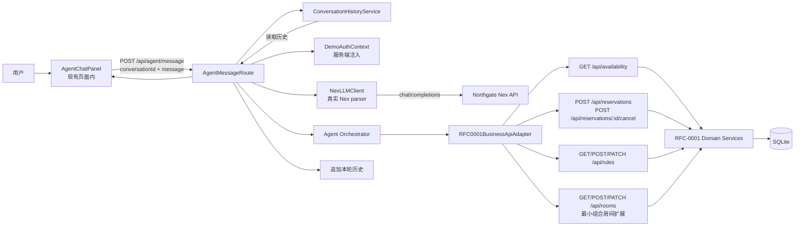
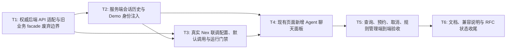

# RFC-0004: Agent 与前端联调闭环设计

## 摘要

本 RFC 把会议室预约系统的 Agent 从“已实现但未联通”推进到“用户可在现有页面真实使用”的闭环。目标是在现有会议室管理页面中新增聊天面板，让用户用自然语言完成查询可用房间、创建预约、取消预约和规则管理；服务端通过真实 Nex parser 解析意图，通过 RFC-0001 权威后端 API 执行状态变更，并保存服务端会话历史。旧的 Agent 私有业务 facade 保留但废弃，不再作为 RFC-0004 的调用路径。

本 RFC 的关键限制是：当前仓库仍是本地 Demo 身份模型，不引入企业级登录；前端不传 `userId`、`role` 或 `authContext`，服务端统一注入 Demo 身份并以后端权限校验为最终边界。真实 Nex 联调默认调用真实模型，因此本地运行必须配置服务端环境变量 `NEX_API_KEY`，且密钥不得进入代码仓库或前端。

## 动机

现状已经具备 Agent 的基础骨架：`POST /api/agent/message` 已注册，`src/agent/nex.ts` 可调 Nex LLM，`src/agent/businessApi.ts` 已把部分 Agent 意图映射到 RFC-0001 权威 API，`src/ui/meetingRoomUi.ts` 已有 RFC-0001 管理页面。但这些能力尚未形成完整用户闭环：

1. 前端页面没有 Agent 聊天入口，也没有调用 `POST /api/agent/message` 的交互逻辑。
2. `src/api/agent.ts` 仍从请求体读取 `history` 和 `authContext`，没有接入服务端会话历史与身份注入。
3. `tests/agent/businessApi.test.ts` 仍断言旧私有业务接口（如 `/api/bookings`、`/api/unavailability-rules`），与 RFC-0003 的权威 API 方向不一致。
4. `tests/agent/nex.test.ts` 都是 mock fetch；用户已明确选择真实 Nex 联调，而不是只验证 mock parser。
5. 现有自动化测试不能证明“前端聊天面板 → Agent API → Nex parser → 权威后端 API → SQLite 状态 → 前端回复”这条链路真实可用。

因此 RFC-0004 的重点不是重新设计 Agent 编排，而是把 RFC-0001、RFC-0002、RFC-0003 已经定义的模块联成一个可手工验收的完整闭环。

## 设计

### 用户看到的完整流程

1. 用户在现有会议室管理页面右侧或下方打开 Agent 聊天面板，输入“明天上午 10 点到 11 点有哪些小会议室可用”。
2. 前端只发送当前消息和会话上下文，不发送 `userId`、`role` 或 `authContext`。
3. 服务端从 Demo 本地身份和会话历史服务中补齐 `userId`、`conversationId`、`authContext` 与历史消息。
4. Agent API 调用真实 Nex parser 解析自然语言为严格 JSON `AgentIntent`。
5. Agent 编排器把意图映射到 RFC-0001 权威 API：可用性查询、预约创建、预约取消、规则创建或规则更新。
6. 后端 API 在 SQLite 中执行权限、冲突和状态写入；Agent 只把后端结果转成自然语言回复。
7. 前端展示回复、解析意图、已执行动作和错误信息；服务端追加本轮用户消息与 Agent 回复到会话历史。

### 概述

RFC-0004 采用“前端聊天面板 + 服务端 Agent 编排 + 权威后端 API + 真实 Nex parser”的单体闭环方案。浏览器仍访问 `GET /` 返回的 `src/ui/meetingRoomUi.ts` 页面；页面在现有 RFC-0001 管理界面中新增 Agent 面板，而不是新增独立 Agent 页面。服务端继续通过 `POST /api/agent/message` 暴露 Agent 统一入口，但请求边界从“前端传完整身份和历史”调整为“前端传消息，服务端注入身份和历史”。

后端业务调用必须优先使用 RFC-0001 权威 API：

- `GET /api/availability?start=&end=&capacity=&equipment=`：查询可用房间。
- `POST /api/reservations`：创建预约。
- `POST /api/reservations/:reservationId/cancel`：取消预约。
- `GET /api/rules`、`POST /api/rules`、`PATCH /api/rules/:ruleId`：规则查询、创建和更新。
- `GET /api/rooms`、`POST /api/rooms`、`PATCH /api/rooms/:roomId`：房间列表与配置，用于解析房间名称、权限辅助和规则管理。

只有当 Agent 需要执行组合房间创建且 RFC-0001 当前 API 缺失时，才新增最小扩展 `POST /api/rooms/combined` 或等价路径；该扩展不扩大为完整房间 CRUD，也不改变 RFC-0001 的权威 API 原则。

### 概念模型

- **AgentChatPanel**：现有页面中的聊天 UI，负责展示消息、输入自然语言、提交 `POST /api/agent/message`，并展示回复、解析意图、动作和错误。
- **AgentMessageRoute**：`POST /api/agent/message` 的服务端入口，负责请求校验、会话历史读取、身份注入、Nex parser 调用、编排执行和响应格式化。
- **DemoAuthContext**：本地 Demo 身份上下文，用于在未接入企业登录时给 Agent 和后端 API 提供稳定的 `actor`、`role` 与权限边界；它不是安全认证替代品。
- **ConversationHistoryService**：服务端会话历史，按 `conversationId` 保存用户消息、Agent 回复、解析意图和动作，供下一轮解析使用。
- **RFC0001BusinessApiAdapter**：Agent 编排器到 RFC-0001 权威 API 的适配层，负责把 `AgentIntent` 转换为权威 API 请求，并把后端错误映射为 Agent 错误。
- **NexLLMClient**：真实 Nex parser 客户端，只从服务端环境变量读取 API key，不接受前端传入的密钥。
- **AgentResponseFormatter**：把 parser 结果、编排动作、后端结果和错误转换成前端可展示的自然语言与结构化字段。

### 关键设计决策

1. **在现有页面新增聊天面板，而不是新建独立 Agent 页面**
   - 原因：用户明确选择现有页面新增聊天面板；这能保留 RFC-0001 表单、列表、日历和管理入口，也便于对比 Agent 回复与真实后端状态。
   - 结果：`renderMeetingRoomApp()` 需要新增 Agent 面板、消息列表、输入框、发送按钮和响应展示区；测试需断言页面包含 Agent UI 和 `/api/agent/message` 调用。

2. **真实 Nex parser 默认调用真实模型**
   - 原因：用户明确选择“真实 Nex 联调”。RFC-0004 的验收应覆盖真实 parser 行为，而不是只覆盖 mock parser。
   - 结果：本地 `npm start` / `npm run dev` 必须配置 `NEX_API_BASE_URL`、`NEX_API_KEY`、`NEX_MODEL`；缺少 `NEX_API_KEY` 时服务应给出清晰启动或请求错误，不能静默降级为 mock。
   - 风险：真实模型调用依赖网络和密钥，手工验收需准备可替换的测试数据或临时规则，避免污染长期状态。

3. **服务端会话历史，而不是前端传完整历史**
   - 原因：前端传历史容易被篡改，也会把隐私和保留策略泄露到浏览器侧。用户已明确选择服务端会话历史。
   - 结果：`AgentMessageRequest` 不再要求前端传 `history` 和 `authContext`；服务端根据 `conversationId` 读取历史，并在响应完成后追加本轮消息。
   - 兼容：测试和旧客户端可暂时仍接受 `history` 字段，但 RFC-0004 实现后正式入口以服务端历史为准。

4. **Demo 身份注入，前端不传身份和角色**
   - 原因：本地 Demo 需要可运行，但权限最终必须以后端为准。前端传 `userId` 或 `role` 会形成可伪造权限边界。
   - 结果：`src/api/agent.ts` 注入固定 Demo 用户，例如 `userId: "local-user"`、`role: "member"`；需要管理员操作时通过受控环境变量或本地配置切换，而不是前端表单选择。
   - 安全边界：`authContext` 只由服务端注入；后端 API 仍基于自己的 `x-actor`、角色和规则校验最终授权。

5. **Agent 调用 RFC-0001 权威 API，最小扩展仅补组合房间缺口**
   - 原因：RFC-0001 是会议室状态写入和冲突判断的权威来源；Agent 不能继续依赖旧私有业务 facade 形成第二套状态路径。
   - 结果：RFC-0004 将 `src/agent/businessApi.ts` 的编排测试改为权威 API 路径；旧的 `agentBusinessRoutes` 若存在或后续恢复，只能保留为兼容/废弃层，不再被 Agent 默认调用。
   - 组合房间：若真实 Nex 解析出 `create_combined_room`，服务端可调用新增的最小组合房间创建 API；该 API 只覆盖创建组合空间所需字段，不扩展到完整房间 CRUD。

6. **保留旧私有业务 facade 但废弃**
   - 原因：用户选择“保留但废弃”。保留可避免破坏已有测试或外部调用；废弃可防止新链路继续分叉。
   - 结果：旧路径可以保留在代码中，但需加 `@deprecated` 注释、README 迁移说明和测试隔离；RFC-0004 的新测试不得依赖这些旧路径作为成功标准。

7. **手工 UI 验收是 RFC-0004 的必需验收，自动化测试作为回归门禁**
   - 原因：用户明确选择手工 UI 验收；真实 Nex 和浏览器交互很难完全用常规 CI 稳定覆盖。
   - 结果：实现必须提供手工验收步骤；同时补 API/UI 自动化测试，确保后续改动不会破坏 Agent 入口、历史注入和权威 API 映射。

### 接口契约

#### 前端到 Agent API

路径：`POST /api/agent/message`

触发时机：用户在现有页面的 Agent 聊天面板发送消息。

请求：

| 字段             | 类型   | 必填 | 说明                                                                       |
| ---------------- | ------ | ---- | -------------------------------------------------------------------------- |
| `conversationId` | string | 是   | 当前会话 ID，可由前端生成并持久化到 `localStorage`，或后端按页面会话创建。 |
| `message`        | string | 是   | 用户当前自然语言输入。                                                     |

前端不再传：

| 字段          | 原因                                                   |
| ------------- | ------------------------------------------------------ |
| `userId`      | 由服务端 Demo 身份注入，避免前端伪造。                 |
| `authContext` | 由服务端注入，避免前端伪造角色或权限。                 |
| `history`     | 由服务端会话历史读取，避免浏览器侧篡改或泄露完整历史。 |

响应：

| 字段           | 类型        | 说明                                                   |
| -------------- | ----------- | ------------------------------------------------------ |
| `reply`        | string      | 给用户展示的自然语言回复。                             |
| `parsedIntent` | object/null | 本次解析出的 `AgentIntent`；信息不足或解析失败时为空。 |
| `actions`      | array       | Agent 已执行或尝试执行的后端动作，用于调试和展示。     |
| `error`        | object/null | 解析、权限、冲突或后端调用失败信息。                   |

#### 服务端身份注入

本地 Demo 默认身份建议为：

| 字段          | 值                                   | 说明                                           |
| ------------- | ------------------------------------ | ---------------------------------------------- |
| `userId`      | `local-user`                         | 本地演示用户。                                 |
| `role`        | `member`                             | 默认成员权限；管理员能力通过受控环境变量切换。 |
| `authContext` | `{ source: "demo", role: "member" }` | 传给 parser 和后端调用的上下文。               |

若需要管理员验收规则管理或组合房间创建，可通过环境变量切换，例如 `MEETING_ROOM_DEMO_ROLE=admin`。该配置只影响本地 Demo，不代表企业级认证。

#### 会话历史契约

新增服务端会话历史能力，至少支持：

- 读取：`GET /api/conversations/:conversationId/history`
- 追加：`POST /api/conversations/:conversationId/messages`

追加请求：

| 字段           | 类型                      | 必填 | 说明                                              |
| -------------- | ------------------------- | ---- | ------------------------------------------------- |
| `role`         | `"user"` \| `"assistant"` | 是   | 消息角色。                                        |
| `content`      | string                    | 是   | 用户消息或 Agent 回复。                           |
| `parsedIntent` | object/null               | 否   | 本轮解析出的意图，便于后续上下文修正。            |
| `actions`      | array                     | 否   | 本轮执行的动作，便于后续“刚才那条规则/预约”引用。 |

历史读取响应保持数组，按时间顺序返回用户消息和 Agent 回复。历史存储可使用 SQLite 新表或本地 JSON 文件；RFC-0004 不要求企业级归档、分页或审计策略。

#### Agent 到 RFC-0001 权威 API 适配

| Agent 意图                        | 权威 API 调用                                            | 说明                                                                    |
| --------------------------------- | -------------------------------------------------------- | ----------------------------------------------------------------------- |
| `query_available_rooms`           | `GET /api/availability?start=&end=&capacity=&equipment=` | 将相对日期和时间范围转换为 UTC 查询参数。                               |
| `create_booking`                  | `POST /api/reservations`                                 | 使用 Demo `x-actor`，标题默认“会议预约”。                               |
| `cancel_booking`                  | `POST /api/reservations/:reservationId/cancel`           | 无 `bookingId` 时先用权威 API 查询候选，再由 Agent 追问或取消唯一候选。 |
| `create_unavailability_rule`      | `POST /api/rules`                                        | 创建动态不可预约规则。                                                  |
| `update_last_unavailability_rule` | `GET /api/rules` + `PATCH /api/rules/:ruleId`            | 通过历史 action 找到上一条规则 ID，找不到时澄清。                       |
| `create_or_update_room`           | `GET /api/rooms` + `POST/PATCH /api/rooms/:roomId`       | 仅在 Demo 管理员权限下执行；普通成员返回权限错误。                      |
| `create_combined_room`            | 最小扩展 `POST /api/rooms/combined`                      | 仅补组合房间创建缺口，不扩展完整房间 CRUD。                             |

后端错误映射保持 RFC-0002/RFC-0003 的 Agent 错误类型：

| 后端情况                                      | Agent 错误            | 前端展示                         |
| --------------------------------------------- | --------------------- | -------------------------------- |
| 缺少日期、时间、房间、目标、规则 ID 或预约 ID | `need_clarification`  | 展示追问，不执行后端写入。       |
| 后端返回 403 或权限不足                       | `permission_denied`   | 明确说明当前 Demo 身份无权限。   |
| 预约冲突、规则冲突或开放时段冲突              | `conflict`            | 展示冲突详情和可能替代方案。     |
| 房间、预约或规则不存在                        | `not_found`           | 说明找不到目标，并引导重新选择。 |
| 后端不可达、空 body 或非 JSON                 | `backend_unavailable` | 说明服务暂时不可用。             |
| Nex 返回非 JSON 或 schema 不匹配              | `parse_failed`        | 要求用户换一种说法或补充信息。   |

### 架构图

## 权衡取舍

### 考虑过的替代方案

1. **新建独立 Agent 页面**
   - 未采用原因：用户明确选择现有页面新增聊天面板；独立页面会割裂 RFC-0001 管理体验，也不利于对比 Agent 回复与真实状态。

2. **前端传 `userId`、`role` 和完整 `history`**
   - 未采用原因：前端可伪造身份和历史，无法作为权限边界；服务端会话历史和 Demo 身份注入更符合用户选择与安全边界。

3. **继续使用 Agent 私有业务 facade**
   - 未采用原因：会形成第二套业务路径，削弱 RFC-0001 权威 API 的状态一致性。RFC-0004 选择保留但废弃旧 facade，新链路只调用权威 API。

4. **真实 Nex 仅在 CI opt-in 或仅手工验证**
   - 未采用原因：用户明确选择默认真实调用。RFC-0004 的本地联调应以真实 Nex 为默认路径；自动化测试可额外覆盖 mock，但不能替代真实联调验收。

5. **一次性扩展完整房间 CRUD 和组合空间管理**
   - 未采用原因：RFC-0004 的验收重点是 Agent 完整闭环，不是房间管理大改。组合房间只允许最小 API 扩展，避免范围失控。

### 缺点

- 默认真实 Nex 调用会增加本地运行门槛，必须配置 `NEX_API_KEY`，并受网络和服务稳定性影响。
- Demo 身份不是真实认证；如果服务暴露到非可信网络，仍需后续 RFC 接入企业身份和授权。
- 服务端会话历史会增加 SQLite 或本地存储状态，需要定义清理策略；本 RFC 仅要求满足上下文修正的基础能力。
- 保留但废弃旧 facade 会留下兼容代码，短期增加维护成本；需要通过文档和测试边界降低误用风险。
- 手工 UI 验收是必需项，意味着 RFC-0004 完成不能只靠常规 CI 通过。

## 实现计划

### 阶段划分

- [ ] Phase 1：把 Agent 业务调用收敛到 RFC-0001 权威 API，并明确旧 facade 废弃边界。
- [ ] Phase 2：实现服务端会话历史与 Demo 身份注入，调整 Agent API 请求边界。
- [ ] Phase 3：接入真实 Nex parser 默认调用与运行门禁。
- [ ] Phase 4：在现有页面新增 Agent 聊天面板并联通 `POST /api/agent/message`。
- [ ] Phase 5：完成查询、预约、取消、规则管理的端到端验收与文档。

### 子任务分解

#### 依赖关系图

#### 子任务列表

| ID  | 标题                                      | 依赖   | Ref |
| --- | ----------------------------------------- | ------ | --- |
| T1  | 权威后端 API 适配与旧业务 facade 废弃边界 | -      | -   |
| T2  | 服务端会话历史与 Demo 身份注入            | T1     | -   |
| T3  | 真实 Nex 联调配置、默认调用与运行门禁     | T1, T2 | -   |
| T4  | 现有页面新增 Agent 聊天面板               | T2, T3 | -   |
| T5  | 查询、预约、取消、规则管理端到端验收      | T4     | -   |
| T6  | 文档、兼容说明与 RFC 状态收尾             | T5     | -   |

> **并行提示**：T1 完成后可并行推进 T2 和 T3；T4 需要 T2/T3 的请求边界和真实 parser 路径稳定；T5/T6 必须串行完成手工验收与文档。

#### 子任务定义

**T1: 权威后端 API 适配与旧业务 facade 废弃边界**

- **范围**：检查并调整 `src/agent/businessApi.ts`、`src/agent/orchestrator.ts`、`src/api/agent.ts` 和 `tests/agent/businessApi.test.ts`，确保 Agent 新链路调用 RFC-0001 权威 API；保留但废弃旧私有业务 facade 的兼容代码或测试隔离。
- **验收标准**：Agent 查询、预约、取消、规则创建/更新不再依赖 `/api/bookings`、`/api/unavailability-rules` 等旧路径；权威 API 映射测试通过；旧 facade 如有保留，必须有废弃注释或文档说明。

**T2: 服务端会话历史与 Demo 身份注入**

- **范围**：新增或完善会话历史服务与 API，调整 `AgentMessageRequest` 边界，使前端不再传 `history` 和 `authContext`；在 `src/api/agent.ts` 中注入 Demo 用户和权限上下文。
- **验收标准**：同一 `conversationId` 连续两轮“创建规则”和“刚才说错了，只停用下午”能读取历史并更新同一条规则；请求体只包含 `conversationId` 和 `message` 时仍可正常处理；前端无法通过传参伪造管理员角色。

**T3: 真实 Nex 联调配置、默认调用与运行门禁**

- **范围**：确保 `src/agent/nex.ts` 使用服务端环境变量 `NEX_API_BASE_URL`、`NEX_API_KEY`、`NEX_MODEL`；补充缺 key、网络失败、schema 不匹配、重试和默认真实调用的运行说明与测试。
- **验收标准**：配置真实环境变量后可调用 Northgate Nex API 并解析出 `AgentIntent`；缺少 `NEX_API_KEY` 时错误清晰；测试不泄露密钥；本地启动文档明确真实 Nex 是默认路径。

**T4: 现有页面新增 Agent 聊天面板**

- **范围**：在 `src/ui/meetingRoomUi.ts` 现有页面中新增 Agent 聊天面板、消息列表、输入框、发送按钮、加载态、错误展示、解析意图和动作展示；前端调用 `POST /api/agent/message`。
- **验收标准**：页面仍保留 RFC-0001 可用性、预约、房间、规则管理入口；新增面板可通过自然语言触发查询、预约、取消、规则管理；前端不传 `userId`、`role` 或 `authContext`；UI 测试包含 Agent 面板和 `/api/agent/message` 调用。

**T5: 查询、预约、取消、规则管理端到端验收**

- **范围**：使用真实 Nex、真实 SQLite、真实 RFC-0001 API 和浏览器 UI 完成四类验收场景：查询可用房间、创建预约、取消预约、规则管理。
- **验收标准**：手工 UI 验收通过；每条 Agent 操作都能在后端 API/SQLite 中观察到对应状态变化；冲突、权限不足、解析失败和后端不可用有清晰前端展示。

**T6: 文档、兼容说明与 RFC 状态收尾**

- **范围**：更新 README、`.env.example`、运行命令、手工验收清单、旧 facade 废弃说明和 RFC-0004 状态记录。
- **验收标准**：新开发者能按文档配置真实 Nex 并启动本地服务；`.env.example` 不含真实密钥；README 明确手工验收步骤、Demo 身份边界、旧 facade 兼容策略和 RFC-0004 完成门禁。

### 影响范围

- `src/ui/meetingRoomUi.ts`：现有页面新增 Agent 聊天面板和前端调用逻辑。
- `src/api/agent.ts`：调整请求边界、服务端身份注入、会话历史读取和响应后追加历史。
- `src/api/history.ts`：从只读客户端扩展为读写会话历史契约，或新增对应服务端实现。
- `src/agent/nex.ts`：真实 Nex 默认调用、环境变量、错误映射和测试边界。
- `src/agent/businessApi.ts`、`src/agent/orchestrator.ts`：RFC-0001 权威 API 映射和旧 facade 废弃边界。
- `src/server.ts`：确认 `POST /api/agent/message` 注册在完整 app 中，并补充会话历史路由。
- `src/server/routes/*`：必要时新增最小组合房间创建 API 和会话历史 API。
- `tests/agent/**`、`tests/api/**`、`tests/ui/**`、`tests/integration/**`：补充权威 API 映射、Agent API、UI 和手工验收辅助测试。
- `docs/rfcs/0004-agent-frontend-integration.md`、`docs/rfcs/meta/0004-agent-frontend-integration.json`、`docs/rfcs/README.md`。
- `.env.example`、README 或运行文档。

## 测试方案

### 单元测试

- `AgentMessageRequest` 校验：缺少 `conversationId` 或 `message` 时返回清晰错误；前端传 `userId`、`role`、`authContext` 不覆盖服务端注入值。
- Demo 身份注入：默认 `local-user` 与 `member`，管理员权限只能通过服务端受控配置切换。
- 会话历史追加/读取：同一 `conversationId` 多轮消息按顺序返回，包含 `parsedIntent` 和 `actions` 元数据。
- Nex parser：真实调用路径使用环境变量；缺 key、HTTP 失败、非 JSON、schema 不匹配和重试行为稳定。
- RFC-0001 adapter：查询、预约、取消、规则创建/更新、组合房间最小扩展映射到正确权威 API。

### 集成测试

- `createApp(db)` 完整挂载 `POST /api/agent/message`、RFC-0001 权威 API、会话历史 API 和静态 UI。
- 使用真实临时 SQLite，验证 Agent 创建预约后，同一时间段再次查询不可返回该房间。
- 验证无 `bookingId` 的取消场景：先查询候选；候选唯一则取消；候选多个则返回 `need_clarification`。
- 验证规则修正场景：第一轮创建规则，第二轮“刚才说错了，只停用下午”能读取历史 action 并 `PATCH` 同一条规则。
- 验证后端 400/403/404/409/5xx 时，Agent API 返回结构化 `error`，前端展示对应错误而不是假成功。

### 真实 Nex 联调

- 默认使用真实 Nex API 调用，环境变量来自服务端 `.env`。
- 手工验收提示词至少覆盖：
  1. “明天上午 10 点到 11 点有哪些小会议室可用？”
  2. “预约 506 明天 10:00 到 11:00，标题项目讨论。”
  3. “取消刚才那条项目讨论预约。”
  4. “把 506 这周三全天设为临时维修。”
  5. “刚才说错了，506 只维修下午。”
- 自动化测试仍可使用 mock fetch 保护常规 CI；真实 Nex 测试作为本地联调或显式运行的验收步骤，不作为无密钥环境下的阻塞项。

### 手工 UI 验收

1. 配置 `.env`：`NEX_API_BASE_URL`、`NEX_API_KEY`、`NEX_MODEL`、`MEETING_ROOM_API_BASE_URL`、`MEETING_ROOM_TIME_ZONE`；确认 `.env` 未提交。
2. 运行 `npm install`、`npm run db:reset`、`npm start`，打开 `http://localhost:3000/`。
3. 在 Agent 聊天面板输入查询可用房间，确认页面展示可用房间列表，后端 SQLite 状态未被误写。
4. 输入创建预约，确认页面展示预约成功，`GET /api/reservations` 或页面预约列表能看到新预约。
5. 输入取消预约，确认页面展示取消成功，预约列表或 API 中该预约状态变为 `cancelled`。
6. 输入创建不可预约规则，确认规则出现在规则列表并影响后续可用性查询。
7. 输入修正上一条规则，确认更新的是同一条规则，而不是新增一条冲突规则。
8. 故意输入冲突预约、无权限操作、缺字段请求和无法解析语句，确认前端展示清晰错误。

## 未解决的问题

无。以下事项已在本 RFC 中明确决策：旧私有业务 facade 保留但废弃；组合房间仅允许最小 API 扩展；真实 Nex 默认真实调用；验收方式以手工 UI 验收为必需项。

## 参考资料

- RFC-0001：本地会议室查询与预订系统。
- RFC-0002：会议室预约系统 Agent 编排设计。
- RFC-0003：Agent 真实可用修复计划。
- `src/api/agent.ts`：当前 Agent 消息 API 入口。
- `src/ui/meetingRoomUi.ts`：当前 RFC-0001 管理页面。
- `src/agent/nex.ts`：真实 Nex parser 客户端。
- `src/agent/businessApi.ts`：Agent 到后端业务 API 的适配层。
- Northgate API endpoint：`https://northgate.xiaobei.top/v1`。
- 模型：`nex-agi/Nex-N2-Pro`。
